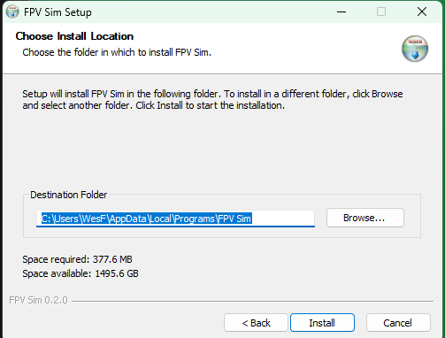
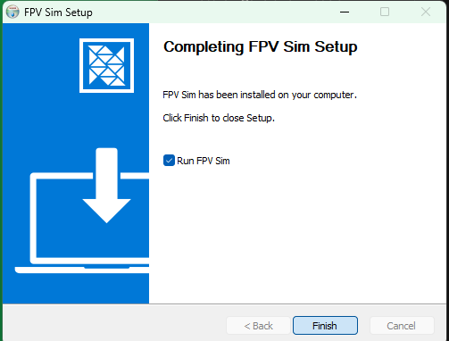
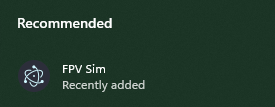

# 2. Installing FPV Sim

This chapter takes you from nothing to the launcher window open on your screen. It is self-contained.

> **Before you start**
> - A PC running 64-bit **Windows 10 (version 1809 or later) or Windows 11**.
> - About 500 MB of free disk space (110 MB installer plus a 380 MB installation).
> - Internet access for the download only. The application itself never needs a network connection.
> - No administrator rights, no Node.js, no Python.

## 2.1 Requirements

| | Requirement | Notes |
|---|---|---|
| Operating system | Windows 10 1809+ or Windows 11, x64 | 32-bit and ARM64 Windows are not supported. |
| Disk | ~500 MB | Installer ~110 MB; the installed application ~380 MB. |
| Rights | Standard user | The installer is per-user and never asks for elevation. |
| Graphics | Any | A **WebGPU-capable GPU and driver** is needed only by the **3D VIEWER** tile. Everything else runs without one. |
| Network | None after install | The MCP endpoint listens on your own PC only; the DIS gateway is off until you stage it (Chapter 10). |

## 2.2 Download

1. Open the releases page of the project: <https://github.com/wasomma/fpv-sim-app/releases/latest>.
2. Under **Assets**, click **`fpv-sim-app-setup-<version>.exe`** (for this manual, `fpv-sim-app-setup-0.2.1.exe`).
   → *The file lands in your Downloads folder. It is about 110 MB.*

> [!WARNING]
> Only run installers you downloaded from the project's own Releases page. The installer is not code-signed, so Windows cannot verify who built it — see the next step.

## 2.3 Run the installer

3. Double-click `fpv-sim-app-setup-<version>.exe` in File Explorer.
   → *Windows SmartScreen shows a blue **Windows protected your PC** dialog reading "Microsoft Defender SmartScreen prevented an unrecognised app from starting". This is expected for an unsigned installer and is not a sign that anything is wrong with the file.*
4. Click **More info**, which reveals the app name and **Publisher: Unknown publisher**, then click the **Run anyway** button that appears.
   → *SmartScreen closes and the setup wizard opens.*

> [!NOTE]
> SmartScreen only warns the first time a given file is run on an account. If you have run this installer before, it starts straight at the wizard.

5. On **Choose Installation Options**, leave **Only for me (*your user name*)** selected and click **Next >**.
   → *The page confirms **Fresh install for current user only.** The **Anyone who uses this computer (all users)** option needs administrator rights; nothing in this manual does.*
6. On **Choose Install Location** accept the default — a folder inside your own profile, `%LOCALAPPDATA%\Programs\FPV Sim` — or click **Browse…** to pick another, then click **Install**.
   → *The page shows the space required (about 380 MB) against the space available, and a progress bar runs for a few seconds while the application is unpacked.*

*Figure 2-1. Choose Install Location: accept or change the folder. No administrator rights are needed.*

7. On the final page, **Completing FPV Sim Setup**, leave **Run FPV Sim** ticked and click **Finish**.

*Figure 2-2. The final page. Leave Run FPV Sim ticked to launch immediately.*

## 2.4 First launch

8. The launcher window opens (Figure 2-3). If you unticked **Run FPV Sim**, start it from the Start menu or the desktop shortcut, both named **FPV Sim** (Figure 2-4).
   → *You should see the window titled FPV SIM with six tiles, a launch bar, and a footer reading `app 0.2.1 · engine fpv-sim-mcp 0.3.0 · ui pin 7050617 · electron 44.0.0 · …`. Those are your version numbers; quote them when you ask for help.*

*Figure 2-3. First launch: the launcher window. The footer is your version stamp.*

*Figure 2-4. Later launches: FPV Sim in the Start menu under Recommended, or the desktop shortcut of the same name.*

The first launch also creates your data folder, `%APPDATA%\fpv-sim-app`, and pre-loads it with the three published Monte Carlo datasets so the Dashboard opens populated. Appendix B lists everything that lives there.

> [!NOTE]
> FPV Sim runs as a single instance. Launching it a second time simply brings the existing window to the front.

9. To confirm the installation works end to end, click the **LAUNCH** button in the launch bar.
   → *A second window opens with the Simulation playing seed 20260719 at 4× speed. Within a few seconds both drones launch and the Event Log starts scrolling. Close it when you have seen enough; Chapter 4 explains every control.*

## 2.5 Upgrading

There is no automatic update. To upgrade, download the newer `fpv-sim-app-setup-<version>.exe` and run it over the existing installation. Nothing has to be uninstalled first, and your datasets and settings in `%APPDATA%\fpv-sim-app` are kept. The launcher footer shows the new version.

## 2.6 Uninstalling

Open **Settings ▸ Apps ▸ Installed apps**, find **FPV Sim**, open its **…** menu and choose **Uninstall**. The uninstaller removes the program folder and the shortcuts.

> [!NOTE]
> Uninstalling deliberately leaves your data folder in place, so a later reinstall finds your sweeps and settings again. To remove everything, also delete `%APPDATA%\fpv-sim-app` (paste that path into the Explorer address bar).

## 2.7 What got installed where

| Item | Location |
|---|---|
| Program files | `%LOCALAPPDATA%\Programs\FPV Sim\` (or the folder you chose) — `FPV Sim.exe` plus the bundled engine, UI pages and runners |
| Shortcuts | Start menu and desktop, both **FPV Sim** |
| Your data | `%APPDATA%\fpv-sim-app\` — `results\` (datasets and the `index.json` manifest) and `settings.json` (the MCP port and token) |
| Uninstaller | `Uninstall FPV Sim.exe` in the program folder, also listed in Settings ▸ Apps |

Appendix B describes the data folder in detail, including how to reset the results store to the factory datasets.
