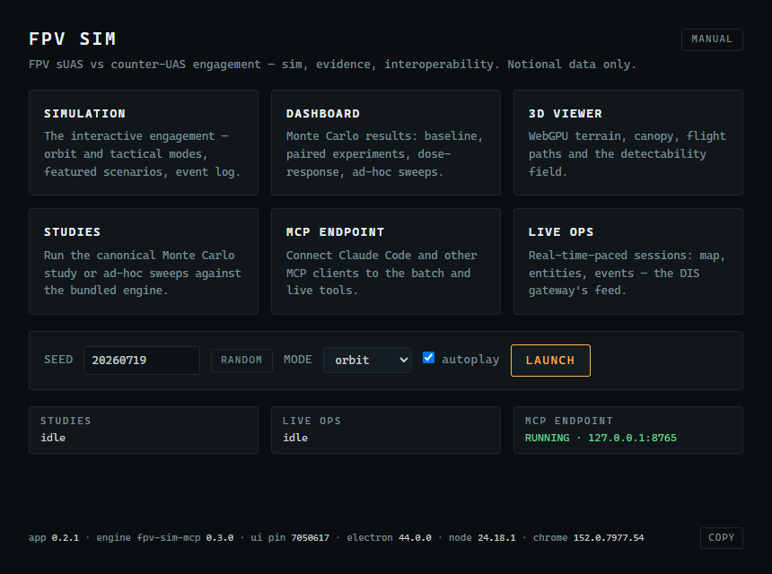
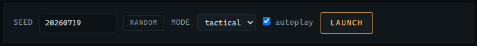

# 3. The launcher window

The launcher is the small window that opens when you start FPV Sim. Everything else in the application is reached from it. This chapter names each of its parts so later chapters can refer to them. The **MANUAL** button in its top-right corner opens this manual (so does <kbd>F1</kbd> in any window).


*Figure 3-1. The launcher window: six tiles, the launch bar, the status strip, and the version footer.*

## 3.1 The six tiles

Each tile is a button. **SIMULATION** and **3D VIEWER** open a **new window** every time, so you can have two Simulation windows on different seeds side by side. **DASHBOARD**, **STUDIES**, **MCP ENDPOINT** and **LIVE OPS** open one window each: clicking the tile again brings that window to the front instead of opening a second copy. The launcher stays open throughout.

| Tile | Opens | Shortcut | Window size | Chapter |
|---|---|---|---|---|
| **SIMULATION** | The interactive 2D engagement page | <kbd>Ctrl</kbd>+<kbd>1</kbd> | 1440 × 920 | 4 |
| **DASHBOARD** | The Monte Carlo results page | <kbd>Ctrl</kbd>+<kbd>2</kbd> | 1440 × 920 | 7 |
| **3D VIEWER** | The WebGPU 3D rendering | <kbd>Ctrl</kbd>+<kbd>3</kbd> | 1440 × 920 | 5 |
| **STUDIES** | The Studies panel (Monte Carlo runner) | <kbd>Ctrl</kbd>+<kbd>4</kbd> | 1100 × 780 | 6 |
| **MCP ENDPOINT** | The MCP Endpoint panel | <kbd>Ctrl</kbd>+<kbd>5</kbd> | 1100 × 780 | 8 |
| **LIVE OPS** | The Live Ops panel (real-time sessions and the DIS gateway) | <kbd>Ctrl</kbd>+<kbd>6</kbd> | 1100 × 780 | 9, 10 |

The shortcuts work from any FPV Sim window, and <kbd>Ctrl</kbd>+<kbd>0</kbd> brings the launcher itself back (see [3.6](#36-the-menu-and-keyboard-shortcuts)).

The first three tiles show the original browser pages of the fpv-sim project, served unchanged from inside the application. The last three are the application's own panels, drawn in the same slate-and-orange style as the Simulation window so that nothing changes but the content when you cross from one to the other. All windows can be resized; the sizes above are what they open at the first time. Each kind of window remembers the size and position you leave it at, and comes back there next time — clamped to the screen, so a window last used on a monitor that is no longer connected reopens on the main display.

## 3.2 The launch bar

The launch bar is a shortcut into the **SIMULATION** tile with parameters:

- **SEED** — the engagement to load. Any integer from 0 to 4,294,967,295. Default **20260719**, the "Standard Engagement (BLUFOR)" scenario. **RANDOM** picks one for you.
- **MODE** — **orbit** or **tactical** (see [1.3](01-overview.md#13-orbit-mode-and-tactical-mode)).
- **autoplay** — when ticked, the engagement starts playing immediately at the Simulation window's default 4× speed; when unticked it opens paused at T+00:00.
- **LAUNCH** — opens the Simulation window with those settings. Pressing <kbd>Enter</kbd> in the **SEED** field does the same.


*Figure 3-2. The launch bar with MODE set to tactical.*

The bar remembers what you last used, so the next launch starts from the same seed and mode.

> [!TIP]
> To watch a specific battle from the Dashboard, you do not need the launch bar: every **WATCH ▸** link there opens the Simulation at the right seed and mode (Chapter 7).

## 3.3 The status strip

Under the launch bar, three cells report what the application is doing in the background, so you never have to open a panel to find out whether something is still running:

| Cell | Reads | Meaning |
|---|---|---|
| **STUDIES** | `idle` | No study or sweep is running. |
| | `running · parallel sweep "…" 1..1000 (orbit) · 1:23` (green) | A run is in progress; the last number is its elapsed time. |
| | `done · … · took 4:10` | The last run finished normally. `failed · … · exit 1` (red) if it did not, or was cancelled. |
| **LIVE OPS** | `idle` | No session. |
| | `orbit · seed 20260719 · T+02:13 · PHASE II // …` (green) | A session is running; `· DIS` is appended while the gateway is publishing, `· PAUSED` (orange) while paused. |
| | `ENDEX · BLUFOR at T+05:11` | The last session ended; `ABORTED · …` (red) if its process failed. |
| **MCP ENDPOINT** | `RUNNING · 127.0.0.1:8765` (green) | The MCP endpoint is listening (Chapter 8). |
| | `DOWN · port 8765 is in use` (red) | It could not start; the reason follows. |

Each cell is a button: click it to open the panel it describes. The strip refreshes every second while something is running and every five seconds otherwise.

## 3.4 The footer

The footer is the application's version stamp:

```text
app 0.2.1 · engine fpv-sim-mcp 0.3.0 · ui pin 7050617 · electron 44.0.0 · node 24.18.1 · chrome 152.0.7977.54
```

| Field | Meaning |
|---|---|
| `app` | The FPV Sim application version. |
| `engine fpv-sim-mcp` | The version of the bundled simulation engine — the code that actually runs every engagement, sweep and live session. |
| `ui pin` | The first seven characters of the fpv-sim commit whose three pages (Simulation, Dashboard, 3D Viewer) are bundled. Engine and UI are pinned as a pair and verified to agree tick for tick. |
| `electron`, `node`, `chrome` | The runtime versions. |

Quote the whole line when you report a problem: **COPY** puts it on the clipboard (the same line is in **Help ▸ About FPV Sim**).

## 3.5 Window behaviour worth knowing

- **Single instance.** Starting FPV Sim while it is already running does not open a second copy; it brings the launcher to the front, or reopens it if you had closed it.
- **Getting the launcher back.** Every panel has a **◂ LAUNCHER** button in its top row, <kbd>Ctrl</kbd>+<kbd>0</kbd> does the same from any window, and so does starting FPV Sim again (Start menu or desktop shortcut).
- **Closing windows.** Closing a Simulation, Dashboard or panel window never stops anything running in the background: a sweep started in the Studies panel keeps running, and a Live Ops session keeps going. The launcher's status strip shows it; reopen the panel to see the details.
- **Closing the last window quits the application** — and *that* does stop a running sweep or live session. If one is active, FPV Sim asks first: **Cancel run and quit** stops it and exits, **Keep running** brings the launcher back and leaves the run alone. The same question appears if you quit any other way while a run is active.
- **Links to the web** (for example **READ THE STUDY** in the Dashboard) open in your default browser, not inside the application.

## 3.6 The menu and keyboard shortcuts

Every FPV Sim window has the same menu bar. It stays hidden until you press <kbd>Alt</kbd> (press <kbd>Alt</kbd> again, or click elsewhere, to hide it), but its shortcuts work all the time:

| Menu | Item | Shortcut | What it does |
|---|---|---|---|
| **File** | **Launcher** | <kbd>Ctrl</kbd>+<kbd>0</kbd> | Brings the launcher to the front, or reopens it. |
| | **Simulation** … **Live Ops** | <kbd>Ctrl</kbd>+<kbd>1</kbd> … <kbd>Ctrl</kbd>+<kbd>6</kbd> | The six tiles, in the order they appear on the launcher (3.1). |
| | **Open Results Folder** | | Opens `%APPDATA%\fpv-sim-app\results` in Explorer (Appendix B). |
| | **Open Settings Folder** | | Opens `%APPDATA%\fpv-sim-app`, where `settings.json` lives. |
| | **Close** | <kbd>Ctrl</kbd>+<kbd>W</kbd> | Closes this window (the last one quits, see 3.5). |
| | **Quit** | <kbd>Ctrl</kbd>+<kbd>Q</kbd> | Quits — asking first if a run is active. |
| **Edit** | **Undo** … **Select All** | the usual keys | Text editing in any field, for example the gateway JSON. |
| **View** | **Reload** | <kbd>Ctrl</kbd>+<kbd>R</kbd> | Reloads this window. In the Dashboard this re-reads the dataset list; a panel comes back as it was. |
| | **Toggle Developer Tools** | <kbd>Ctrl</kbd>+<kbd>Shift</kbd>+<kbd>I</kbd> | The browser developer pane; its **Console** tab shows any error messages from that window. |
| | **Zoom In** / **Zoom Out** / **Actual Size** | <kbd>Ctrl</kbd>+<kbd>=</kbd> / <kbd>Ctrl</kbd>+<kbd>-</kbd> / <kbd>Ctrl</kbd>+<kbd>Shift</kbd>+<kbd>0</kbd> | Text size for a lab-bench display; the panels share one zoom level, the three fpv-sim pages another. |
| | **Toggle Full Screen** | <kbd>F11</kbd> | |
| **Help** | **User Manual** | <kbd>F1</kbd> | This manual (the bundled PDF, or the online copy). |
| | **Changelog** | | What changed in each version, online. |
| | **Report a Problem…** | | The project's issue tracker, online. |
| | **About FPV Sim** | | The version line of 3.4, with a **Copy version line** button. |

FPV Sim keeps no log files. If you are asked for diagnostics, open **View ▸ Toggle Developer Tools** in the window in question and read its **Console** tab; Appendix B.5 lists the other places to look.
