# 4. The Simulation window

The Simulation window is the interactive 2D engagement. This chapter explains every control and teaches you to read the map, the status cards and the Event Log. Open it from the **SIMULATION** tile (it loads the default scenario, paused) or from the launch bar (**LAUNCH**, which can start it playing).

## 4.1 Layout

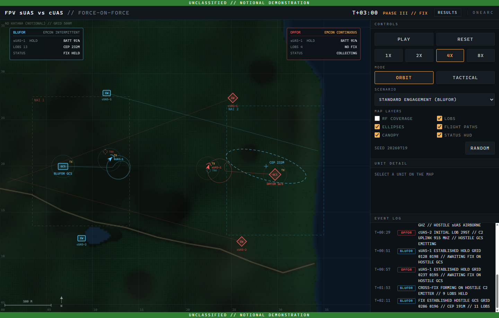
*Figure 4-1. The Simulation window at T+03:00 of seed 20260719: Phase III, BLUFOR holding a fix on the OPFOR GCS.*

From top to bottom and left to right:

- **Banner** — `UNCLASSIFIED // NOTIONAL DEMONSTRATION`, top and bottom.
- **Header** — the title with the mode tag (`// TACTICAL` appears in tactical mode), the **clock** (`T+03:00`), the current **phase** (`PHASE III // FIX`), the **RESULTS** link (brings the Dashboard window forward, opening it if need be — this window stays on the battle) and the brand mark.
- **Map** — the 4 km × 4 km area of operations with a 500 m grid, scale bar and north arrow. Two **Status HUD** cards sit in the upper corners.
- **CONTROLS** — playback, mode, scenario, map layers, seed.
- **UNIT DETAIL** — live data for the unit you last clicked.
- **EVENT LOG** — the narrated engagement, newest at the bottom.

## 4.2 Controls

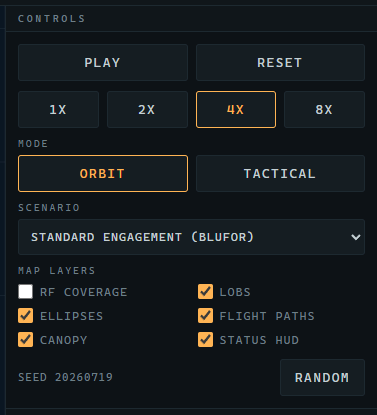
*Figure 4-2. Controls: Play/Reset, speed, Mode, Scenario, Map Layers, SEED and Random.*

| Control | What it does |
|---|---|
| **PLAY** / **RESET** | Start or pause the engagement; **RESET** rewinds the current seed to T+00:00. While playing the button reads **PAUSE**. |
| **1X 2X 4X 8X** | Playback speed. **4X** is the default. The physics always advances in fixed 0.1 s ticks, so speed changes how fast you watch, never what happens. |
| **MODE** — **ORBIT** / **TACTICAL** | Switches the air plan (see [1.3](01-overview.md#13-orbit-mode-and-tactical-mode)). The seed is kept, so you can compare the same emplacement under both plans. |
| **SCENARIO** | Curated seeds with known, instructive outcomes (table below). Picking one loads it paused. |
| **MAP LAYERS** | Six toggles, described in 4.4. |
| **SEED** | The seed of the loaded engagement, for reference. |
| **RANDOM** | Loads a random seed (the Scenario list then shows *Custom*). The same random seed can always be replayed later by typing it into the launcher's **SEED** field. |

> [!NOTE]
> Speed buttons change playback only. Two people watching the same seed at 1× and 8× see the identical battle.

## 4.3 Featured scenarios

The **SCENARIO** list changes with the mode. These are ordinary seeds whose engagements were observed to make a teaching point; the first entry of each mode is the default.

**Orbit mode**

| Scenario | Seed | What it shows |
|---|---|---|
| Standard Engagement (BLUFOR) | 20260719 | The default. A representative disciplined win: fix at T+02:11, commit at T+04:27, strike at T+05:11. |
| Discipline Wins, Fast (BLUFOR) | 66 | The EMCON advantage converts quickly. |
| Deliberate Fix (BLUFOR) | 57 | A slower, methodical collection problem. |
| OPFOR Prevails | 41 | The continuous emitter gets lucky and wins the race. |
| Close Race (OPFOR) | 59 | Both sides fix within about three seconds of each other; BLUFOR's fix is held just above the commit gate by lopsided collection and OPFOR strikes first. |

**Tactical mode**

| Scenario | Seed | What it shows |
|---|---|---|
| Standard Engagement (BLUFOR) | 12 | Both packages fly in full; BLUFOR fixes at T+03:36, launches its hunter-killer at T+05:47 and kills at T+06:56. OPFOR never fixes. |
| Discipline Wins, Fast (BLUFOR) | 26 | Two sorties are enough: fix at T+01:12, hunter away at T+01:52, impact at T+02:59. |
| Final Push (BLUFOR) | 5 | The fix never reaches the commit gate; with the package spent BLUFOR launches on its best fix and the terminal search recovers the miss. |
| Close Race (BLUFOR) | 18 | Both hunter-killers are airborne within 14 s of each other; BLUFOR strikes first. |
| OPFOR Prevails | 41 | The continuous emitter fixes first (same seed as the orbit scenario of that name). |
| Lopsided Collection (Stalemate) | 14 | BLUFOR holds 33 LOBs but nearly all from one node; the fix never tightens, both packages are spent, both GCS survive. |

## 4.4 Map layers

| Toggle | Default | Shows |
|---|---|---|
| **RF COVERAGE** | off | Dashed rings around each DF node at its maximum detection range against the emitter classes it can hear. Useful for understanding why an emitter goes unheard. |
| **LOBS** | on | Recent lines of bearing from DF intercepts. Each fades over 30 s. Thin lines in the collecting side's colour, radiating from the node that heard the emission. |
| **ELLIPSES** | on | Each side's current error ellipse for its fix on the enemy GCS, with the CEP printed beside it (`CEP 232M`). |
| **FLIGHT PATHS** | on | Breadcrumb trails behind each drone. |
| **CANOPY** | on | The vegetation overlay. Canopy also degrades radio propagation in the model, so it matters for who hears whom. |
| **STATUS HUD** | on | The two team cards in the upper map corners (4.6). |

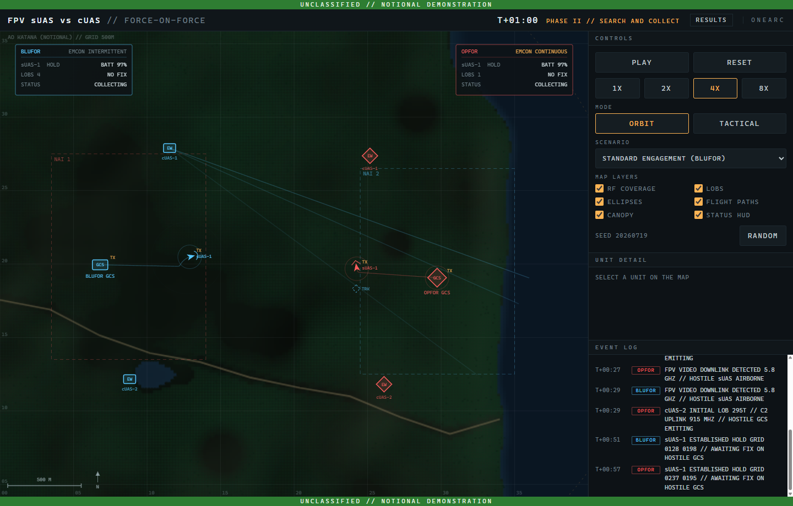
*Figure 4-3. RF Coverage on at T+01:00: each DF node's maximum detection range.*

## 4.5 Reading the map

Everything on the map is drawn in its team's colour, blue for BLUFOR and red for OPFOR.

| Symbol | Meaning |
|---|---|
| Square labelled **GCS** | A ground control station. A pulsing ring and a **TX** tag mean its C2 uplink is keyed right now. |
| Diamond labelled **EW** | A DF node (`cUAS-1`, `cUAS-2`). |
| Arrowhead | A drone, pointing along its heading. A ring and **TX** tag mean its video downlink is keyed; **TRK** marks a drone the enemy is tracking by that downlink. |
| Dashed rectangle **NAI 1 / NAI 2** | Named areas of interest — where each side expects the enemy GCS to be emplaced. |
| Thin fading lines | Lines of bearing (LOBS layer). |
| Dashed ellipse with a **+** and `CEP …M` | A side's fix on the enemy GCS: the ellipse is the estimate's uncertainty, the cross its centre. |
| Dashed circle **OBJ TANTO** | Tactical mode only: the contested objective. |
| Grey unit | Destroyed or downed. |

The 500 m grid is numbered along the edges so positions can be read as four-digit grid references — the same references the Event Log prints (`GRID 0286 0196`).

## 4.6 The Status HUD

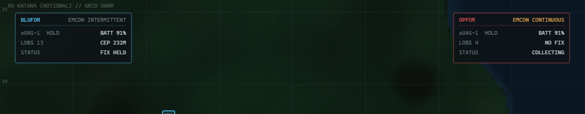
*Figure 4-4. Status HUD cards at T+03:00: BLUFOR holds a fix (CEP 232 m from 13 LOBs); OPFOR is still collecting.*

Each card summarises its team's race to a fix:

| Row | Meaning |
|---|---|
| Header | Team name and EMCON posture (**INTERMITTENT** or **CONTINUOUS**). |
| `sUAS-1 HOLD` / `BATT 91%` | Drone state and battery. States you will see: **STANDBY**, **HOLD** (orbiting), **COMMIT** (attack run), **TERMINAL**, **IMPACT**, **LINK LOST**, **DOWNED**. |
| `LOBS 13` / `CEP 232M` | Lines of bearing held on the enemy GCS and the current fix quality. **NO FIX** until a fix exists. |
| `STATUS` | **COLLECTING**, **FIX HELD**, **ATTACK COMMITTED**, **GCS DESTROYED**, and so on. |

Tactical mode cards add sortie bookkeeping: `SORTIES 3/5 FLOWN`, `AIRBORNE 0`, `DELIVERED 3`, `HK IN RESERVE`.

## 4.7 Unit Detail

Click any unit on the map — a GCS, a DF node or a drone — to populate **UNIT DETAIL**. The panel updates live while the engagement plays. Click empty map to clear it.

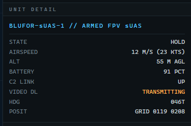
*Figure 4-5. Unit Detail for the BLUFOR drone: state, airspeed, altitude, battery, link states, heading and grid position.*

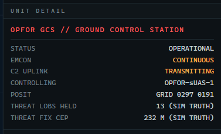
*Figure 4-6. Unit Detail for the OPFOR GCS: emission posture, threat LOBs held on it and the enemy's fix quality.*

## 4.8 The Event Log

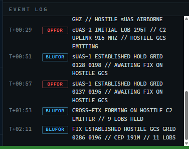
*Figure 4-7. The Event Log narrates the engagement in message-traffic style.*

Every line is `time · team tag · text`. The tag is **BLUFOR**, **OPFOR** or **SYS**. The messages that mark the story of an engagement, in the order you will meet them:

| Message | Meaning |
|---|---|
| `SIMULATION INITIALIZED // SEED …` | T+00:00. |
| `… GCS AND cUAS DF NODES EMPLACED GRID … // EMCON …` | Phase I done; each side's posture is declared. |
| `sUAS-1 LAUNCH GRID … // KINETIC PAYLOAD // HOLDING FWD OF FLOT PENDING FIX` | A drone is airborne (BLUFOR at T+00:20, OPFOR at T+00:26 in the default seed). |
| `cUAS-2 INITIAL LOB 065T // C2 UPLINK 915 MHZ // HOSTILE GCS EMITTING` | A DF node's first bearing on the enemy uplink. |
| `FPV VIDEO DOWNLINK DETECTED 5.8 GHZ // HOSTILE sUAS AIRBORNE` | The enemy drone's video has been heard. |
| `CROSS-FIX FORMING ON HOSTILE C2 EMITTER // 9 LOBS HELD` | Bearings from both nodes are starting to cross. |
| `FIX ESTABLISHED HOSTILE GCS GRID 0286 0196 // CEP 191M // 11 LOBS` | Phase III: a trusted fix exists. |
| `ATTACK COMMIT // sUAS-1 EGRESS HOLD // TASKED HOSTILE GCS GRID 0295 0190 // CEP 117M` | Phase IV: the fix passed the commit gate. |
| `sUAS-1 TERMINAL PHASE // DESCENDING BELOW CANOPY FOR VISUAL ID` | Final approach. |
| `sUAS-1 VISUAL ACQ HOSTILE GCS // COMMENCING ATTACK RUN` | The operator sees the target. |
| `IMPACT // HOSTILE GCS DESTROYED GRID 0297 0191` | The strike. |
| `ENDEX // BLUFOR VICTORY T+05:11` | End of exercise. |

Other lines you may see: `FINAL PUSH` (a low-battery commit on the best available fix), `LINK LOST // NO OPERATOR IN THE LOOP` (the side whose GCS was destroyed loses its drone), `DOWNED` (battery exhausted), and in tactical mode the sortie stream — `SORTIE 3 OF 5 // TGT OBJ TANTO`, `PILOT ON MANUAL CONTROL`, `STRIKE DELIVERED // 3 OF 5 ON TARGET`, `HUNTER-KILLER LAUNCH`.

## 4.9 The four phases in the header

The header phase text steps through `PHASE I // EMPLACEMENT`, `PHASE II // SEARCH AND COLLECT`, `PHASE III // FIX` and `PHASE IV // ATTACK`, then `ENDEX`. Phase III begins with the first side's `FIX ESTABLISHED`; Phase IV with the first `ATTACK COMMIT`.

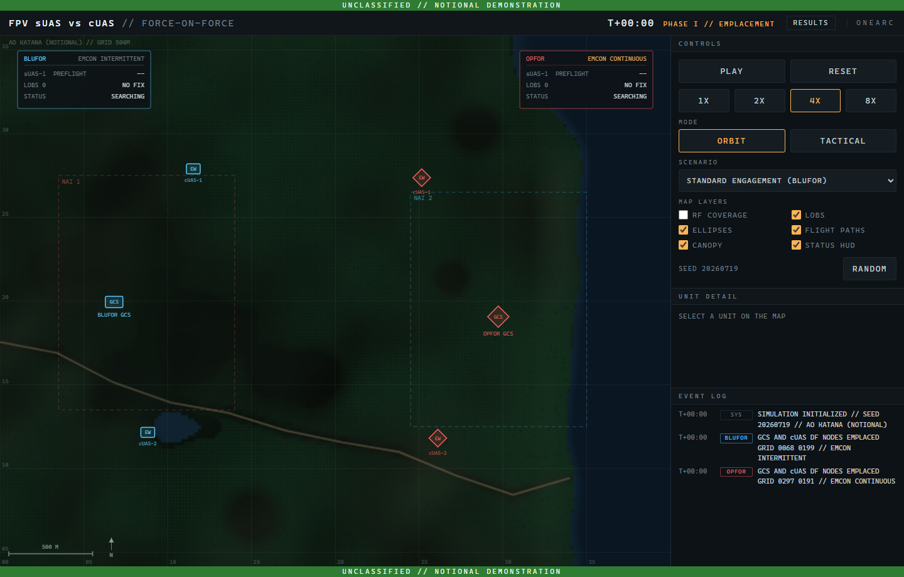
*Figure 4-8. T+00:00, Phase I // EMPLACEMENT: both sides are still setting up; no drone has launched.*

*Figure 4-9. T+01:00, Phase II // SEARCH AND COLLECT: both drones are airborne and the first lines of bearing are coming in.*

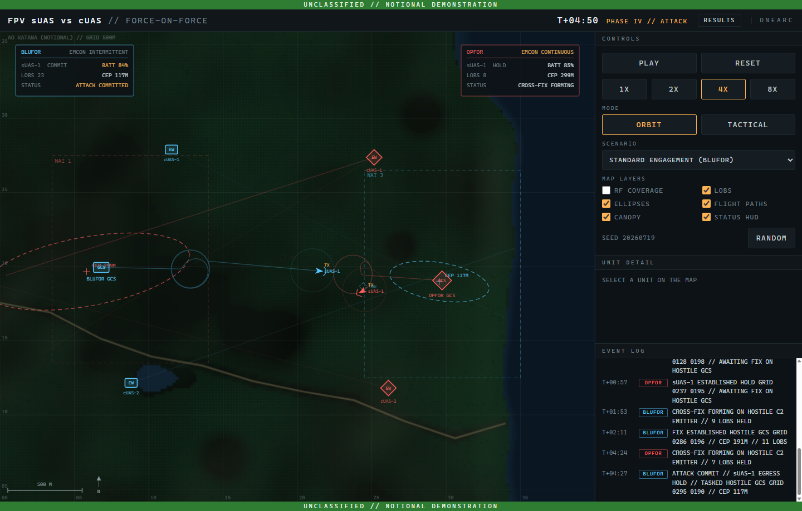
*Figure 4-10. T+04:50, Phase IV: the BLUFOR drone has left its hold and is inbound on the fix; OPFOR is still collecting.*

## 4.10 ENDEX

When a GCS is destroyed (or, in tactical mode, when both packages are spent), the engagement runs on for five more seconds so the consequences show in the log, then the ENDEX overlay appears.

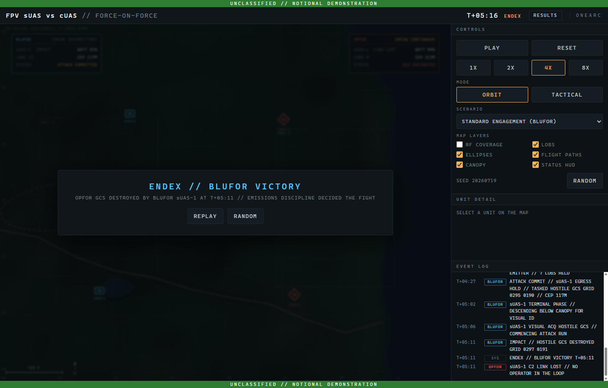
*Figure 4-11. ENDEX overlay after the strike: Replay the same seed or pick a Random one.*

- **REPLAY** — rewinds the same seed and starts playing.
- **RANDOM** — loads a random seed and starts playing.

The overlay's subtitle states the outcome and its reason in one line, for example `OPFOR GCS DESTROYED BY BLUFOR sUAS-1 AT T+05:11 // EMISSIONS DISCIPLINE DECIDED THE FIGHT`.

## 4.11 Tactical mode specifics

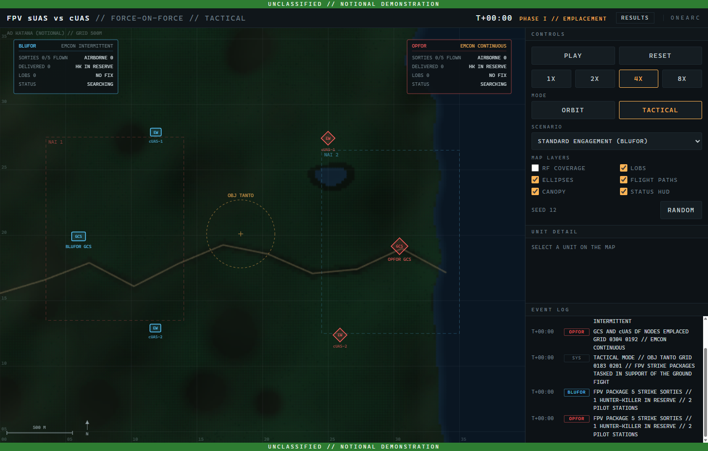
*Figure 4-12. Tactical mode, seed 12 at T+04:00: the objective ring, sorties in flight, BLUFOR's fix held, hunter-killers still in reserve.*

In tactical mode the map gains the **OBJ TANTO** ring, the HUD cards count sorties flown, airborne and delivered, and the Event Log narrates each sortie's transit, hand-over to manual control and impact. Watch the HUD's `HK IN RESERVE` line: it changes to a hunter-killer launch the moment a side's fix reaches the commit gate. If the package is spent first, the side launches its hunter on the best fix it holds; if neither side can, the engagement ends in a stalemate with both GCS alive.

## 4.12 Deep links (for the curious)

The launcher and the Dashboard open this window with parameters in its address: `?seed=20260719`, `&mode=tactical`, `&play=1`. You never type these yourself, but you will see them in the Dashboard's **WATCH ▸** links, and they explain why a link reproduces a battle exactly rather than approximately.
