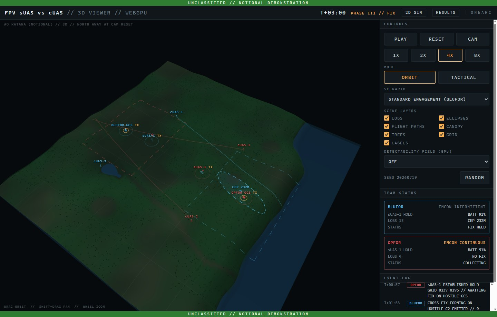
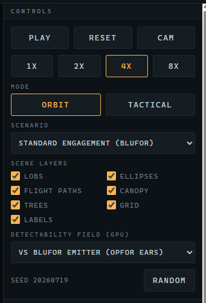
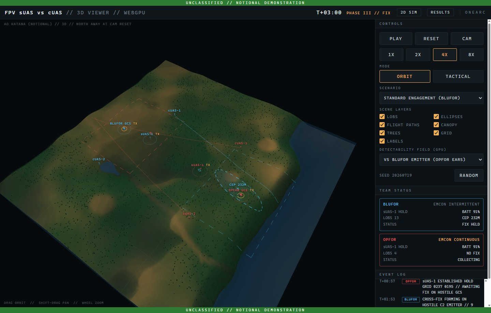

# 5. The 3D Viewer

The 3D Viewer renders the same engagement as the Simulation window in three dimensions using WebGPU: terrain in relief, drones at their true altitude, lines of bearing and error ellipses draped on the ground, and a GPU-computed **detectability field** that makes the radio-propagation model visible. It contains no simulation code of its own — it loads the engine from the Simulation page at start-up, so the engagement it shows for a seed is tick for tick the one the 2D window plays.

> **Before you start**
> A WebGPU-capable GPU and driver. Most PCs from the last several years qualify. If yours does not, the viewer says so clearly (5.5) and everything else in FPV Sim still works.

## 5.1 Opening and first look

Click the **3D VIEWER** tile.
→ *A `LOADING ENGINE` card shows for a moment while the viewer fetches the engine, then the terrain appears with the default scenario loaded and paused.*

*Figure 5-1. The 3D Viewer at T+03:00 of seed 20260719: terrain in relief, LOBs and the BLUFOR error ellipse draped on the ground, Team Status cards on the right.*

The header shows the clock and phase exactly as the 2D window does, plus two links: **2D SIM** (the Simulation page) and **RESULTS** (the Dashboard). Both open in this same window.

## 5.2 Camera

The hint in the bottom-left corner says it all: **DRAG ORBIT // SHIFT-DRAG PAN // WHEEL ZOOM**.

| Gesture | Effect |
|---|---|
| Drag with the left button | Orbit the camera around its target. |
| <kbd>Shift</kbd>+drag, or drag with the right button | Pan the target across the terrain. |
| Mouse wheel | Zoom in and out. |
| **CAM** button | Reset the camera to the default view. North is *away* from you at reset (the label `NORTH AWAY AT CAM RESET` reminds you). |

On a touch screen the gestures are drag to orbit, pinch to zoom and two-finger drag to pan.

## 5.3 Controls

*Figure 5-2. Viewer controls: Cam reset, Scene Layers, Detectability Field. The field is shown switched on here; it is **Off** until you choose a side.*

**PLAY / RESET**, the speed buttons **1X 2X 4X 8X**, **MODE**, **SCENARIO**, **SEED** and **RANDOM** work exactly as in the Simulation window (Chapter 4). The differences:

| Control | Notes |
|---|---|
| **CAM** | Camera reset (5.2). |
| **SCENE LAYERS** | **LOBS**, **ELLIPSES**, **FLIGHT PATHS** and **CANOPY** as in 2D, plus **TREES** (individual canopy trees), **GRID** (the 500 m grid on the terrain) and **LABELS** (unit names). There is no RF Coverage toggle and no Status HUD toggle; the Team Status cards are always shown. |
| **DETECTABILITY FIELD (GPU)** | Off by default; see 5.4. |

The right-hand column holds the **TEAM STATUS** cards (the same content as the 2D HUD cards) and the **EVENT LOG**. There is no Unit Detail panel in the viewer; use the 2D window for per-unit numbers.

## 5.4 The detectability field

The detectability field answers the question "if an uplink were transmitting from *this* point on the map, what is the per-scan probability that the opposing DF nodes would intercept it?" — and answers it for every point at once, on the GPU, every frame.

Choose **VS BLUFOR EMITTER (OPFOR EARS)** to see where a BLUFOR transmitter would be heard by OPFOR's two DF nodes, or **VS OPFOR EMITTER (BLUFOR EARS)** for the reverse. Warm colours mean likely interception; dark areas are radio shadow behind ridges or under canopy.

*Figure 5-3. Detectability field, BLUFOR emitter versus OPFOR ears: the terrain and canopy carve out where a transmission goes unheard.*

Two things to try:

- Compare the field with each side's actual GCS position. A GCS emplaced in a shadowed pocket is fixed later or never; that is the geometry behind the "Deliberate Fix" and "Lopsided Collection" scenarios.
- Toggle **CANOPY** off and on while the field is showing to see how much of the shadow is trees rather than terrain.

## 5.5 When WebGPU is not available

If the PC has no WebGPU-capable GPU or driver, the viewer replaces the scene with a card headed **WEBGPU UNAVAILABLE**: *"This 3D viewer needs a WebGPU-capable browser (Chrome/Edge 113+, recent Safari or Firefox). The simulation engine itself loaded fine — the 2D sim link above works everywhere."*

What to do:

1. Update the graphics driver from the GPU vendor and try again.
2. If it still fails, use the **SIMULATION** tile. It shows the identical engagement, just in 2D.

> [!NOTE]
> The 3D Viewer is the only part of FPV Sim that needs a GPU. Studies, the Dashboard, Live Ops and the DIS gateway are unaffected.
