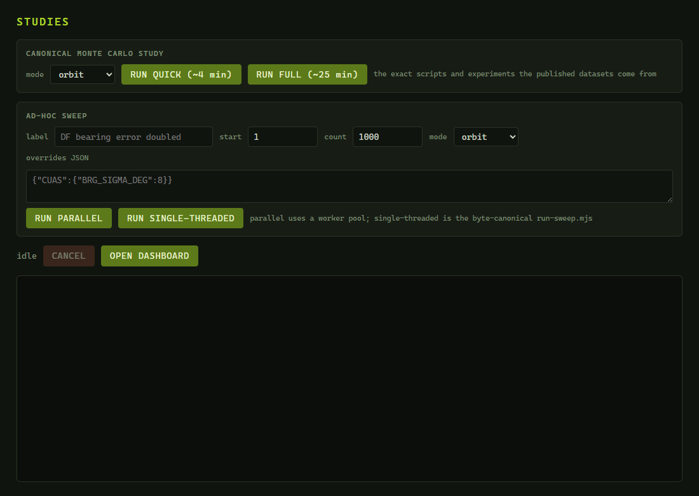
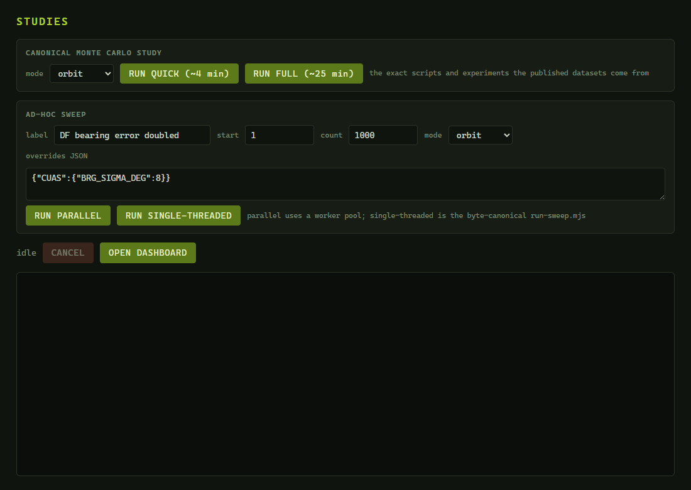
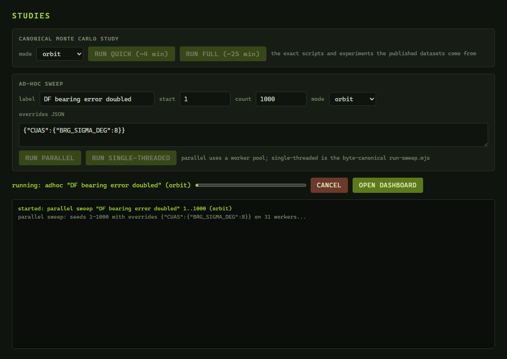
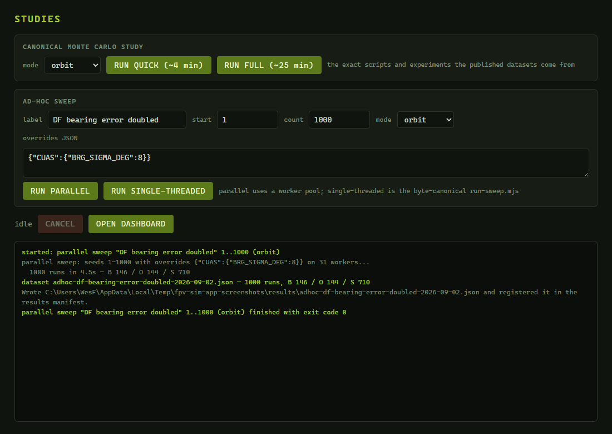
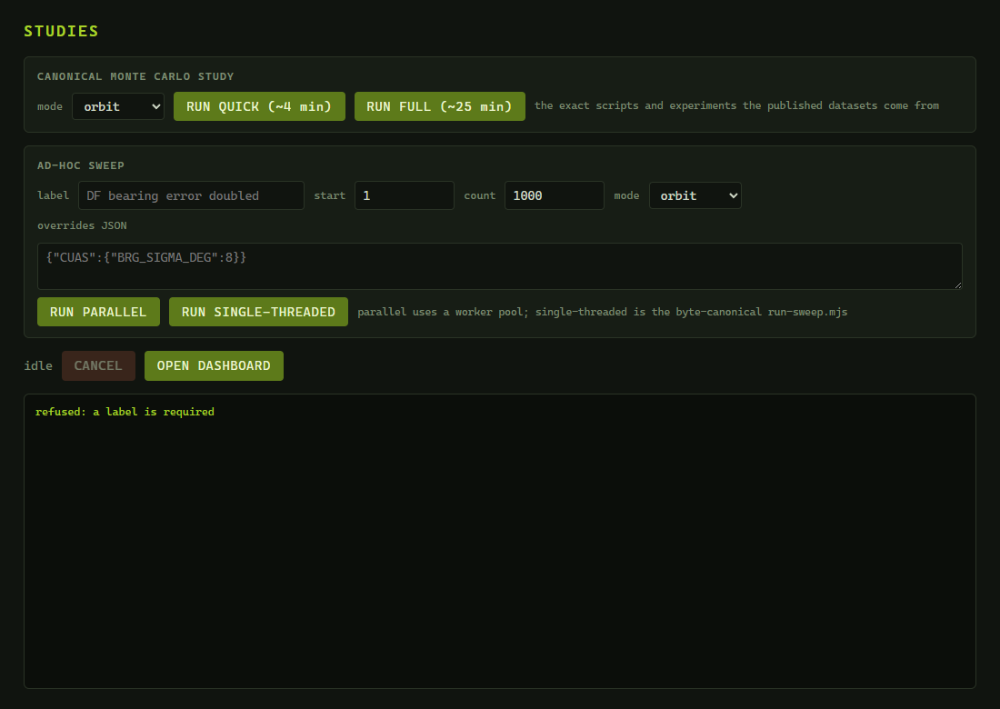

# 6. Running Monte Carlo studies

A single engagement is a story; a thousand engagements are evidence. This chapter shows you how to run Monte Carlo sweeps and the canonical study on your own PC from the **STUDIES** panel. Chapter 7 then reads the results in the Dashboard.

> **Before you start**
> - FPV Sim installed (Chapter 2). Nothing else.
> - About two minutes for the guided exercise; about 25 minutes for the full canonical study.

## 6.1 Concepts in one page

- An **engagement** is one battle from one seed.
- A **sweep** runs a contiguous range of seeds (for example 1 to 1000) under one configuration and aggregates who won, how fast each side fixed, and how the outcomes are distributed.
- An **ad-hoc sweep** is a sweep you define: a label, a seed range, a mode and, optionally, **overrides** — JSON that changes engine parameters such as the DF bearing error or a team's uplink duty cycle.
- The **canonical study** is the fixed set of experiments behind the published results: the 10,000-seed baseline (E1), the paired same-seed comparisons (E2), the 12-cell uplink duty-cycle dose response (E3). 22,800 engagements in orbit mode, 24,800 in tactical mode.
- Every run writes one **dataset** file into your results folder, `%APPDATA%\fpv-sim-app\results`, and registers it in the **manifest** (`index.json`) that the Dashboard lists.
- Results are computed by the bundled engine — the same code that draws the Simulation window — so a sweep run on your PC reproduces the published numbers exactly.

## 6.2 The Studies panel

Click the **STUDIES** tile.


*Figure 6-1. The Studies panel before any run.*

| Region | Controls |
|---|---|
| **CANONICAL MONTE CARLO STUDY** | **mode** (orbit/tactical), **RUN QUICK (~4 min)**, **RUN FULL (~25 min)** |
| **AD-HOC SWEEP** | **label**, **start**, **count**, **mode**, **overrides JSON**, **RUN PARALLEL**, **RUN SINGLE-THREADED** |
| Status row | the status text (`idle` or `running: …`), a progress bar while a parallel sweep runs, **CANCEL**, **OPEN DASHBOARD** |
| Log | everything the run prints, newest at the bottom (the last 800 lines are kept) |

Only one run — study or sweep — can be active at a time.

## 6.3 Guided exercise, part A: run a sweep

The question: *what happens when the DF sensors are twice as noisy?* The stock 1-sigma bearing error is 4°; we double it to 8°. This is the panel's own example, and the published results already contain the same experiment, so you get an answer key.

1. In **AD-HOC SWEEP**, type the **label** `DF bearing error doubled`.
   The label is required; it also names the file (`adhoc-df-bearing-error-doubled-<date>.json`) and the entry in the Dashboard.
2. Leave **start** at `1`, **count** at `1000` and **mode** at **orbit**.
3. In **overrides JSON**, type:
   ```json
   {"CUAS":{"BRG_SIGMA_DEG":8}}
   ```


*Figure 6-2. The guided exercise filled in: label, 1000 seeds, orbit, and the bearing-error override.*

4. Click **RUN PARALLEL**.
   → *The status turns green (`running: adhoc "DF bearing error doubled" (orbit)`), a progress bar appears and fills, CANCEL becomes active, and the log reports how many worker threads it is using.*


*Figure 6-3. A parallel sweep in progress: green status, progress bar, CANCEL enabled.*

5. Wait for it to finish — typically 5 to 60 seconds depending on your CPU.
   → *The log ends with a green* `dataset` *line and the exit code:*
   ```text
   started: parallel sweep "DF bearing error doubled" 1..1000 (orbit)
   parallel sweep: seeds 1–1000 with overrides {"CUAS":{"BRG_SIGMA_DEG":8}} on 31 workers...
     1000 runs in 5.4s — B 146 / O 144 / S 710
   dataset adhoc-df-bearing-error-doubled-2026-09-02.json — 1000 runs, B 146 / O 144 / S 710
   Wrote C:\Users\…\fpv-sim-app\results\adhoc-df-bearing-error-doubled-2026-09-02.json and registered it in the results manifest.
   parallel sweep "DF bearing error doubled" 1..1000 (orbit) finished with exit code 0
   ```


*Figure 6-4. The finished sweep: the green dataset line is your answer key, then the exit code.*

> [!NOTE]
> Your counts should read exactly **B 146 / O 144 / S 710** — BLUFOR wins, OPFOR wins, stalemates over seeds 1–1000. The engine is deterministic, so every PC gets the same numbers. If yours differ, your build has a different engine version (check the launcher footer).

6. Click **OPEN DASHBOARD** and continue with [Chapter 7, section 7.2](07-dashboard.md#72-guided-exercise-part-b-analyze-the-sweep).

## 6.4 The canonical study

The two **RUN** buttons in **CANONICAL MONTE CARLO STUDY** execute the exact scripts and experiments the published datasets come from.

| Button | Engagements (orbit / tactical) | Writes | Appears in the Dashboard? |
|---|---|---|---|
| **RUN QUICK (~4 min)** | about 2,400 / 2,600 — every experiment at one tenth scale | `monte-carlo-quick.json` (or `monte-carlo-tactical-quick.json`) | **No.** Quick runs are a smoke test; the file is written but never registered in the manifest. |
| **RUN FULL (~25 min)** | 22,800 / 24,800 | `monte-carlo.json` (or `monte-carlo-tactical.json`) | **Yes** — it replaces the bundled dataset of the same name (identical numbers, today's date). |

> [!WARNING]
> **RUN QUICK** output never appears in the Dashboard. Use it only to check that the study machinery works. If you want a dataset you can analyze, run an ad-hoc sweep (6.3) or the full study.

> [!WARNING]
> **RUN FULL** overwrites the bundled `monte-carlo.json` entry in your results folder. Because the engine is deterministic the numbers come back identical, but the file's date changes. To restore the factory datasets, see [Appendix B](B-files-and-settings.md).

Procedure:

1. Choose the **mode**.
2. Click **RUN FULL (~25 min)**.
   → *The status turns green. There is **no progress bar** for studies; follow the log instead. It prints one block per experiment:*
   ```text
   started: full study (orbit)
   E1 baseline (stock config)...
     stock: 10000 runs in 660.2s — B 4801 / O 2814 / S 2385
   E2 stock arm (shared across paired comparisons)...
     stock arm: 2000 runs in …s — B … / O … / S …
   E2 OPFOR adopts BLUFOR discipline...
     variant: 2000 runs in …s — B … / O … / S …
   E2 full EMCON posture swap...
   E2 launch stagger equalized...
   E3 uplink duty-cycle sensitivity...
     uplink 2/12 video continuous: 400 runs in …s — B … / O … / S …
     …
   Wrote C:\Users\…\fpv-sim-app\results\monte-carlo.json (22800 engagements)
   Updated C:\Users\…\fpv-sim-app\results\index.json
   full study (orbit) finished with exit code 0
   ```
   E1 is almost half of the total time. In tactical mode an extra E2 experiment, *no reserve hunter*, is added.
3. Reload the Dashboard (Chapter 7) to see the refreshed dataset.

A quick run prints the same blocks at one tenth the size and ends with `Wrote …\monte-carlo-quick.json (… engagements)` and **no** `Updated …\index.json` line — that missing line is why it never shows up in the Dashboard.

## 6.5 Ad-hoc sweep reference

| Field | Meaning | Rules |
|---|---|---|
| **label** | Name of the dataset in the Dashboard; also the file slug (lower-cased, non-alphanumerics become `-`, cut at 48 characters). | Required. |
| **start** | First seed. | Integer ≥ 0. Default 1. |
| **count** | Number of consecutive seeds. | Integer ≥ 1. Default 1000. |
| **mode** | orbit or tactical. | |
| **overrides JSON** | Engine parameter changes as a JSON object, or empty for the stock configuration. | Must be valid JSON. See 6.6. |

The two run buttons produce byte-identical datasets; they differ in how they get there.

| Button | How it runs | Progress | When to use |
|---|---|---|---|
| **RUN PARALLEL** | A pool of worker threads (one per CPU core minus one) shares the seeds. | Progress bar plus the green `dataset` summary line. | Normally. |
| **RUN SINGLE-THREADED** | The canonical `run-sweep.mjs` script from the fpv-sim project, one engagement at a time. | Log only. | When you want the literal published script, for example to reproduce a result outside the application with the same command. |

Other controls:

- **CANCEL** kills the run. Datasets are written only at the very end, so a cancelled run leaves nothing behind — no partial file, no manifest entry.
- **OPEN DASHBOARD** opens the Dashboard window.
- Closing the Studies window does **not** cancel a run. Reopen it and the status row shows `running: …` again.

Refusals are printed in the log rather than shown as dialogs:

| Log line | Cause |
|---|---|
| `refused: a label is required` | Empty label. |
| `refused: overrides is not valid JSON` | A syntax error in the overrides box (a missing brace or quote). |
| `refused: a adhoc run is already active` (or `study`, `sweep`) | Another run is in progress; wait or **CANCEL** it. |


*Figure 6-5. Refusals appear in the log: here RUN PARALLEL with an empty label.*

## 6.6 Choosing overrides

Overrides are a JSON object whose sections and keys mirror the engine's configuration. Four validated examples:

| Purpose | Overrides |
|---|---|
| Double the DF bearing error (the exercise) | `{"CUAS":{"BRG_SIGMA_DEG":8}}` |
| Give OPFOR a very low uplink duty cycle with continuous video (one cell of the E3 dose response) | `{"TEAMS":{"OPFOR":{"uplinkOn":2,"uplinkOff":12,"videoOn":1,"videoOff":0}}}` |
| Make OPFOR as disciplined as BLUFOR (the E2 "OPFOR adopts BLUFOR discipline" arm) | `{"TEAMS":{"OPFOR":{"uplinkOn":4,"uplinkOff":13,"videoOn":3,"videoOff":7}}}` |
| Tactical mode without the reserve hunter-killer and with bigger packages | `{"TACTICAL":{"RESERVE_HUNTER":false,"SORTIES":{"BLUFOR":7,"OPFOR":7}}}` |

[Appendix D](D-overrides-quick-reference.md) lists the most useful keys with their defaults and ranges; the full table (every tunable, unit and rationale) is `PARAMETERS.md` in the fpv-sim project, and the MCP tool `get_config_schema` (Chapter 8) returns the same information to an AI assistant.

> [!WARNING]
> The overrides box is checked for JSON **syntax only**. A misspelled key such as `"BRG_SIGMA"` is silently ignored and the sweep runs with the stock value — yet the dataset still records your text as its overrides. When a result surprises you by matching the baseline exactly, check the spelling against Appendix D.

## 6.7 Managing datasets

- **Same label, same day** — the new file overwrites the old one (the name includes only the date), and the manifest entry is replaced.
- **Deleting a dataset** — delete its file from `%APPDATA%\fpv-sim-app\results` and remove its entry from `index.json` in the same folder (a plain-text JSON list; delete the whole `{ … }` block for that file). Reload the Dashboard.
- **Factory reset** — delete the entire `results` folder while FPV Sim is closed. The next start recreates it with the three bundled datasets. Your own sweeps are gone, so copy any you want to keep first.
- **Sharing a dataset** — send the JSON file together with its `index.json` entry; the recipient drops both into their own results folder.

Appendix B has the exact layout of the folder.
