# 7. Analyzing results in the Dashboard

The Dashboard turns datasets into evidence: win rates with confidence intervals, the dose-response curve, the paired experiments, the timing distributions and links back to the individual battles. This chapter reads every card and finishes the guided exercise begun in Chapter 6.

> **Before you start**
> - FPV Sim installed (Chapter 2).
> - Ideally, the sweep from [6.3](06-studies.md#63-guided-exercise-part-a-run-a-sweep). If you skipped it, the bundled dataset `AD-HOC · DF bearing error doubled (8 deg)` is the same experiment and every step below works with it.

## 7.1 Opening the Dashboard

Three ways, all equivalent: the **DASHBOARD** tile, **OPEN DASHBOARD** in the Studies panel, or the **RESULTS** link in the Simulation and 3D Viewer headers.

> [!NOTE]
> The Dashboard reads the list of datasets **once, when it opens**. A run finished from the Studies panel reloads every open Dashboard by itself, so the new entry simply appears. Only a dataset you copied into the results folder by hand (Appendix B) needs <kbd>Ctrl</kbd>+<kbd>R</kbd>, or a close and reopen.

## 7.2 Guided exercise, part B: analyze the sweep

1. Open the Dashboard (if it was already open it has reloaded by itself).
   → *The newest dataset loads by default — your sweep. The **DATASET** box reads* `AD-HOC · DF bearing error doubled · <today> · 1,000 runs`.

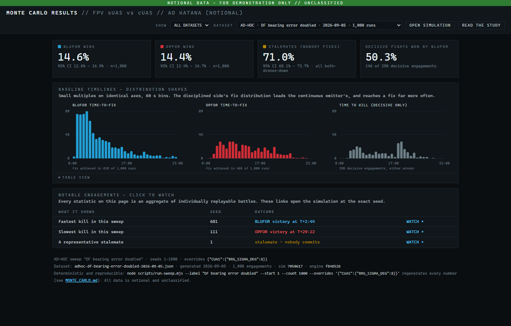
*Figure 7-1. The Dashboard right after the exercise: your ad-hoc dataset is selected.*

2. Read the summary tiles.
   → *BLUFOR wins 14.6%, OPFOR wins 14.4%, Stalemates (nobody fixes) 71.0%, each with a 95% confidence interval and n=1,000. Decisive fights won by BLUFOR: 50.3% — 146 of 290.*

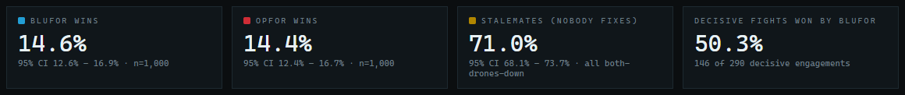
*Figure 7-2. Twice the bearing error: stalemates dominate and the EMCON advantage disappears.*

   Doubling the bearing error starved both estimators. Seven fights in ten now end with nobody reaching a commit-quality fix, and among the fights that *are* decided the disciplined side no longer has an edge — bad bearings hurt the listener more than radio silence helps the talker.

> [!NOTE]
> Ad-hoc datasets show tiles, histograms, notable engagements and provenance only. The *Dose response* and *Paired comparisons* cards belong to the canonical study and do not appear for sweeps. That is expected.

3. Scroll down: the **Baseline timelines** show fewer and later fixes; **Notable engagements** offers a *Fastest kill in this sweep*, a *Slowest kill in this sweep* and *A representative stalemate*; the provenance footer echoes your overrides and the command that reproduces the file.
4. Now switch **DATASET** to `STUDY · Full study · 2026-08-24 · 22,800 runs`.
   → *The tiles read 48.0 / 28.1 / 23.9, and 63.0% of decisive fights go to BLUFOR.*

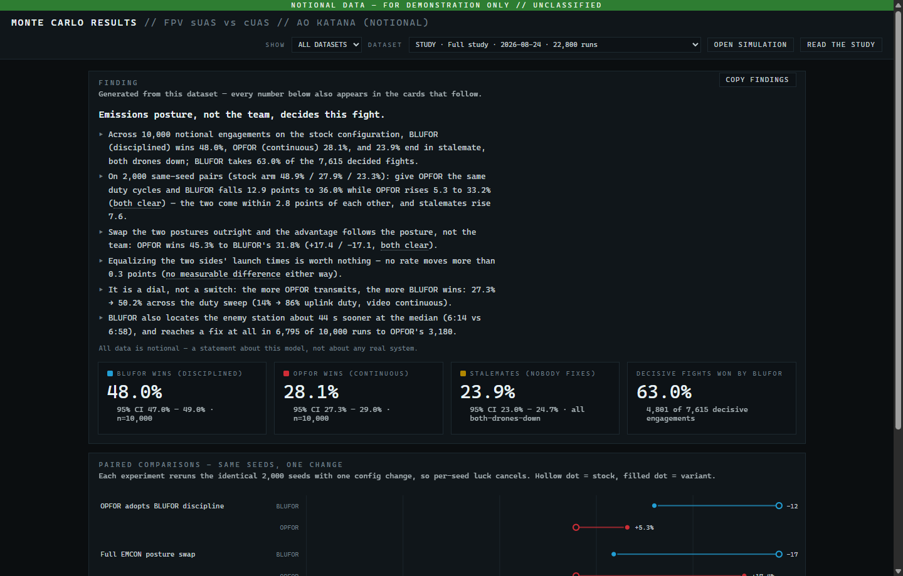
*Figure 7-3. The Dashboard with the full study selected: every card the canonical study populates.*

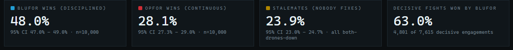
*Figure 7-4. The stock baseline over 10,000 seeds: the disciplined side wins 48.0% to 28.1%.*

   The comparison sentence you should now be able to make: *with stock sensors 76% of engagements are decisive and the disciplined side wins them 63/37; with the bearing error doubled only 29% are decisive and they split 50/50.*

5. Switch back to your sweep and click **WATCH ▸** on *A representative stalemate*.
   → *The Simulation opens at that seed in this same window and plays. Watch the LOBs: with 8° of error the cross-fix never tightens below the commit gate.* Return with the Simulation's **RESULTS** header link.
6. Set **SHOW** to **AD-HOC ONLY**.
   → *The list now contains your sweep and the bundled `DF bearing error doubled (8 deg)` dataset side by side — identical numbers, different dates.*

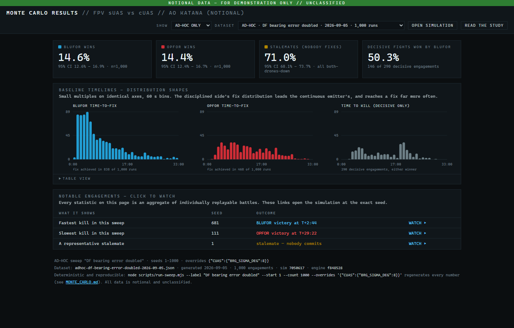
*Figure 7-5. SHOW → AD-HOC ONLY lists only sweeps; yours sits beside the bundled 8° dataset.*

That completes the exercise. The rest of the chapter is a reference to every card.

## 7.3 The header


*Figure 7-6. SHOW filter, DATASET selector, and the two header links.*

| Control | Meaning |
|---|---|
| **SHOW** | **ALL DATASETS**, **STUDIES ONLY** or **AD-HOC ONLY**. Changing it reloads the first matching dataset. |
| **DATASET** | Every dataset in your manifest, newest first, named `STUDY[ · TACTICAL] · <label> · <date> · <n> runs` or `AD-HOC[ · TACTICAL] · <label> · <date> · <n> runs`. |
| **OPEN SIMULATION** | Opens the Simulation page in this window. |
| **READ THE STUDY** | Opens the published write-up (`MONTE_CARLO.md`) in your web browser. Needs internet. |

## 7.4 Summary tiles

| Tile | Meaning |
|---|---|
| **BLUFOR WINS (DISCIPLINED)** / **OPFOR WINS (CONTINUOUS)** | Share of engagements each side won, with a 95% Wilson confidence interval and the sample size. Ad-hoc datasets drop the posture labels because your overrides may have changed them. |
| **STALEMATES (NOBODY FIXES)** | Share ending with both GCS alive. Orbit stalemates are all *both drones down*; tactical ones (labelled **PACKAGES SPENT**) are all *packages expended*. |
| **DECISIVE FIGHTS WON BY BLUFOR** | BLUFOR wins divided by all decided fights — the EMCON effect with stalemates removed. |
| **STRIKES DELIVERED ON THE OBJECTIVE** | Tactical datasets only: mean strikes each side landed on OBJ TANTO before ENDEX (`4.5 / 4.5` of 5 in the stock study). |

The first three tiles always sum to 100%.

## 7.5 Dose response (studies only)

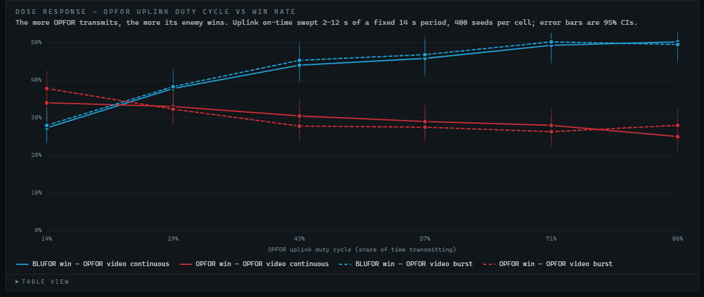
*Figure 7-7. Dose response: win rate versus OPFOR uplink duty cycle, with 95% CI whiskers.*

Experiment E3 sweeps OPFOR's uplink on-time from 2 s to 12 s of a fixed 14 s period (a duty cycle of 14% to 86%) with 400 seeds per cell, once with OPFOR's video continuous and once with it in 3 s/7 s bursts. Blue lines are BLUFOR's win rate, red OPFOR's; solid is video-continuous, dashed is video-burst.

How to read it: **the more OPFOR transmits, the more its enemy wins** — smoothly, like a dial. BLUFOR's win rate climbs about 23 points from left to right; OPFOR's falls about 9; and at the leftmost cell, where OPFOR is quieter than stock BLUFOR, OPFOR actually out-wins it.

Hover any point for the cell's exact numbers; **TABLE VIEW** below the chart lists every cell.

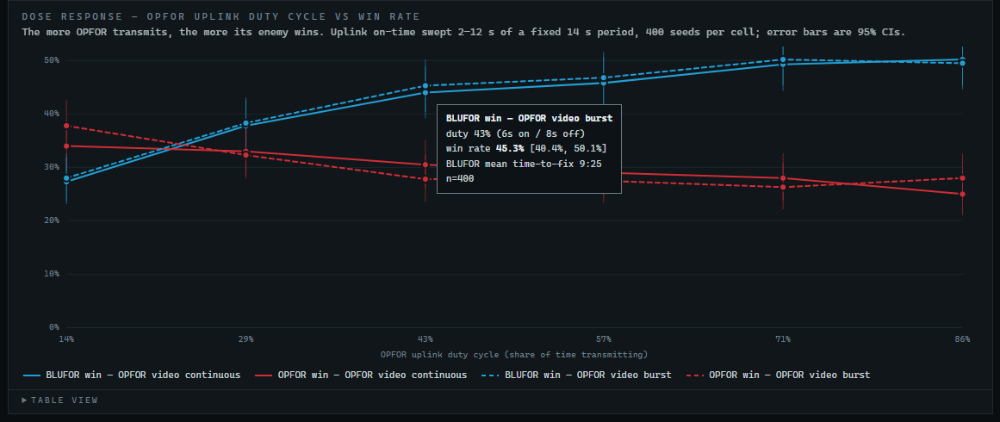
*Figure 7-8. Hovering a point shows the cell's duty cycle, win rate, CI, BLUFOR's mean time to fix and n.*

## 7.6 Paired comparisons (studies only)

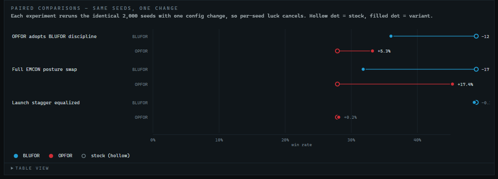
*Figure 7-9. Paired comparisons: hollow = stock, filled = variant, on the same 2,000 seeds.*

Experiment E2 reruns the identical 2,000 seeds with one configuration change each, so per-seed luck cancels and the difference is the effect. Each row is a dumbbell from the stock win rate (hollow dot) to the variant (filled dot); the delta is printed to the right. Hover for the number of seeds whose outcome flipped.

| Row | Change | Headline (orbit study) |
|---|---|---|
| **OPFOR adopts BLUFOR discipline** | OPFOR gets BLUFOR's duty cycles | BLUFOR −12.9 points, OPFOR +5.3. Discipline is worth about 13 points of win rate. |
| **Full EMCON posture swap** | The two teams exchange postures | BLUFOR −17.1, OPFOR +17.4. The advantage follows the posture, not the team. |
| **Launch stagger equalized** | OPFOR launches at T+00:20 like BLUFOR | Within half a point either way. The six-second head start is worth nothing. |
| **No reserve hunter (retask a strike)** | Tactical only: no dedicated hunter-killer | The largest effect in the whole battery: both sides' win rates roughly halve and stalemates rise from 52% to 79%. |

## 7.7 Baseline timelines

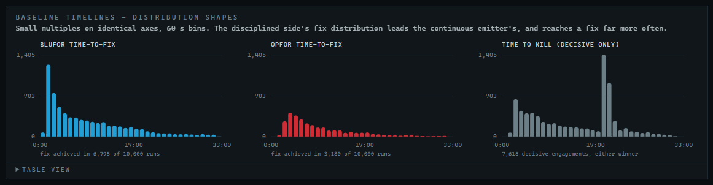
*Figure 7-10. Baseline timelines: time to fix for each side and time to kill, in 60 s bins.*

Three histograms on identical axes: **BLUFOR TIME-TO-FIX**, **OPFOR TIME-TO-FIX** and **TIME TO KILL (DECISIVE ONLY)**. The note under each says how many engagements contributed (in the stock study BLUFOR fixes in 6,795 of 10,000 engagements, OPFOR in 3,180). The disciplined side's distribution sits earlier and is far taller. This card is drawn for ad-hoc datasets too.

## 7.8 Notable engagements

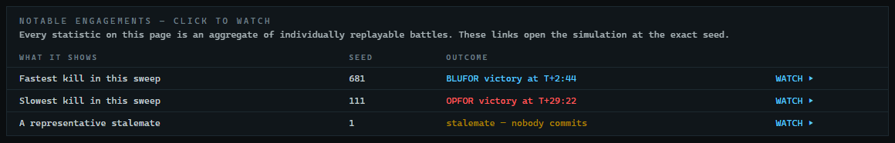
*Figure 7-11. Notable engagements: WATCH opens the exact battle behind a statistic.*

Every number on the page is an aggregate of individually replayable battles. This table picks a few — the fastest kill, the slowest kill, a representative stalemate and, for studies, the fastest kill with postures swapped — and its **WATCH ▸** links open the Simulation at that seed (and mode) and start it playing.

> [!NOTE]
> **WATCH ▸** and **OPEN SIMULATION** replace the Dashboard in the same window. Come back with the Simulation's **RESULTS** header link, or open a fresh Dashboard from the launcher.

## 7.9 Provenance

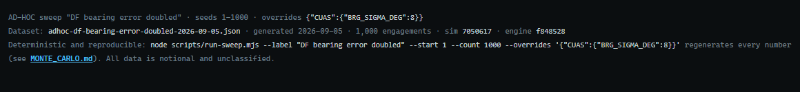
*Figure 7-12. Provenance for an ad-hoc dataset: the overrides echoed and the command that regenerates it.*

The footer names the dataset file, its generation date and engagement count, the engine and simulation commits it was produced with, and the exact command that regenerates it. For ad-hoc datasets it also echoes the label, seed range and overrides. This is what makes a result citable.

## 7.10 Tactical datasets

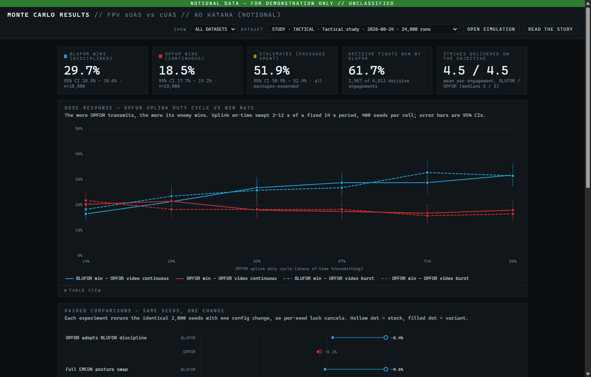
*Figure 7-13. The tactical study: a fifth tile for strikes delivered and the same experiment cards.*

Select `STUDY · TACTICAL · Tactical study` to see the tactical numbers: BLUFOR 29.7%, OPFOR 18.5%, stalemates 51.9% (all packages expended), BLUFOR winning 61.7% of decisive fights, and 4.5 strikes delivered per side. The EMCON findings replicate at this shorter exposure window, and the paired card gains the *No reserve hunter* row.

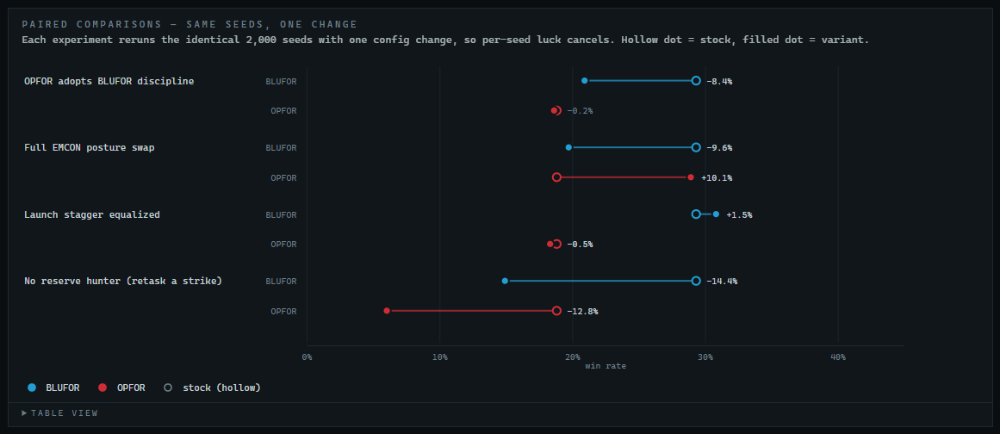
*Figure 7-14. Tactical paired comparisons, including the reserve-hunter experiment.*

## 7.11 Going further: reproduce a paired arm yourself

Seeds 1–2000 are exactly the seed list the paired experiments use. Run an ad-hoc sweep with label `OPFOR adopts discipline`, **start** 1, **count** 2000, **mode** orbit and overrides

```json
{"TEAMS":{"OPFOR":{"uplinkOn":4,"uplinkOff":13,"videoOn":3,"videoOff":7}}}
```

Its tiles should read **36.0 / 33.2 / 30.9** — the *OPFOR adopts BLUFOR discipline* variant of the study, reproduced on your PC.
