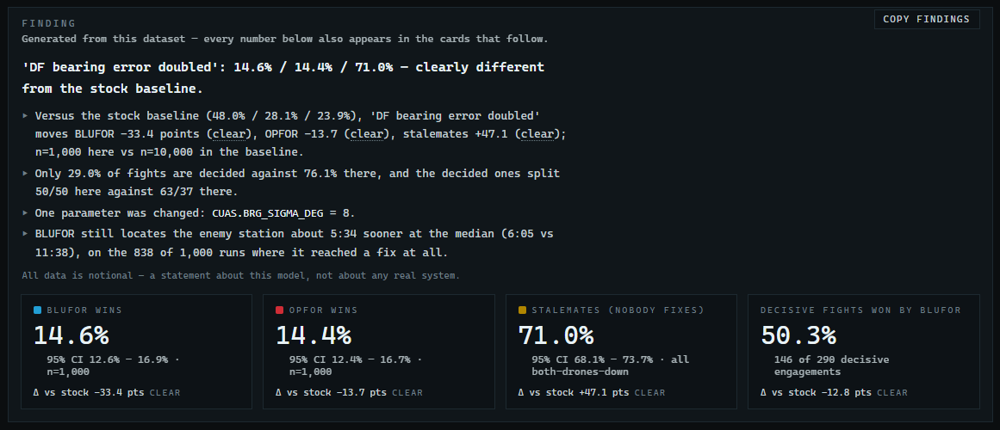
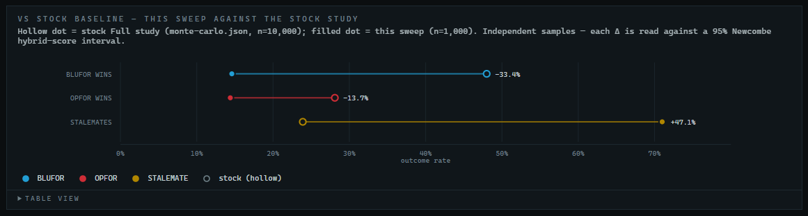
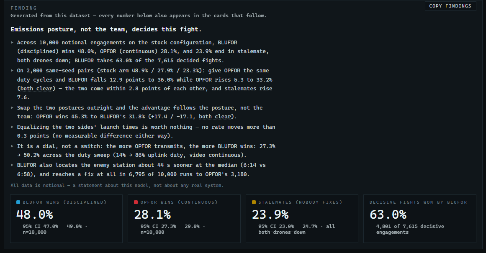

# 7. Analyzing results in the Dashboard

The Dashboard turns a dataset into a finding. It opens on a plain-English verdict generated from the numbers themselves, keeps the one chart that carries the evidence in view, and folds everything else — the dose-response curve, the timing distributions, the notable engagements, the provenance — under a single **ALL EVIDENCE** line. This chapter finishes the guided exercise begun in Chapter 6 and then reads every layer.

> **Before you start**
> - FPV Sim installed (Chapter 2).
> - Ideally, the sweep from [6.3](06-studies.md#63-guided-exercise-part-a-run-a-sweep). If you skipped it, the bundled dataset `AD-HOC · DF bearing error doubled (8 deg)` is the same experiment and every step below works with it.

## 7.1 Opening the Dashboard

| From | Opens on |
|---|---|
| The **DASHBOARD** tile, **OPEN DASHBOARD** in the Studies panel, <kbd>Ctrl</kbd>+<kbd>2</kbd> | the newest dataset — or brings the open Dashboard forward as it is |
| **OPEN IN DASHBOARD** in the Studies panel's LAST DATASET box, **OPEN** on a DATASETS row | that dataset — an open Dashboard switches to it |
| The **RESULTS** link in the Simulation and 3D Viewer headers | brings the open Dashboard forward, or opens it on the newest dataset |

> [!NOTE]
> The Dashboard reads the list of datasets **once, when it opens**, and keeps the dataset it is showing in its address (`?dataset=<file>`). A run finished from the Studies panel switches every open Dashboard to the new dataset. A manifest change from the DATASETS box (rename, delete, register, restore) reloads an open Dashboard on the dataset it was showing, and so does <kbd>Ctrl</kbd>+<kbd>R</kbd>. Only a dataset you copied into the results folder by hand needs **REGISTER** (Chapter 6.7) before the Dashboard can list it.

## 7.2 Guided exercise, part B: read the finding

1. In the Studies panel, click **OPEN IN DASHBOARD** in the LAST DATASET box.
   → *The Dashboard opens on your sweep. The **DATASET** box reads* `AD-HOC · DF bearing error doubled · <today> · 1,000 runs`, *and the page leads with a card titled FINDING.*


*Figure 7-1. The Dashboard right after the exercise: the finding for your ad-hoc dataset, its tiles, and the vs-stock card.*

2. Read the finding.
   → *The bold line says* **'DF bearing error doubled': 14.6% / 14.4% / 71.0% — clearly different from the stock baseline.** *Under it, one line per point: versus the stock baseline (48.0% / 28.1% / 23.9%) the sweep moves BLUFOR −33.4 points (clear), OPFOR −13.7 (clear), stalemates +47.1 (clear); only 29.0% of fights are decided against 76.1% there, and the decided ones split 50/50 here against 63/37 there; one parameter was changed,* `CUAS.BRG_SIGMA_DEG` = 8; *and BLUFOR still locates the enemy station about 5:34 sooner at the median, on the 838 of 1,000 runs where it reached a fix at all.*


*Figure 7-2. The finding for the doubled-bearing-error sweep: verdict, deltas against the stock study, the override that was changed.*

   That is the result, and the page wrote it from the numbers. What it means is yours to add: doubling the bearing error starved both estimators. Seven fights in ten now end with nobody reaching a commit-quality fix, and among the fights that *are* decided the disciplined side no longer has an edge — bad bearings hurt the listener more than radio silence helps the talker.

3. Read the summary tiles under the finding.
   → *BLUFOR wins 14.6%, OPFOR wins 14.4%, Stalemates (nobody fixes) 71.0%, each with its 95% confidence interval and n=1,000, and each with a* Δ vs stock *line: −33.4, −13.7, +47.1 points, all* clear. *Decisive fights won by BLUFOR: 50.3% — 146 of 290 — against 63/37 in the stock study.*


*Figure 7-3. Summary tiles for the doubled-bearing-error sweep, each with its delta against the stock study.*

4. Read the **VS STOCK BASELINE** card.
   → *One dumbbell per outcome: the hollow dot is the stock study's rate, the filled dot is this sweep's, and the delta is printed at the end. Hover a row for both confidence intervals and both sample sizes; **TABLE VIEW** below the chart lists the deltas with their intervals and the word each earned.*


*Figure 7-4. VS STOCK BASELINE: hollow = the stock study, filled = this sweep, one dumbbell per outcome.*

5. Click **ALL EVIDENCE**.
   → *The fold opens on the **Baseline timelines** (fewer and later fixes than the stock study), **Notable engagements** offering a* Fastest kill in this sweep, *a* Slowest kill in this sweep *and* A representative stalemate, *and the provenance footer echoing your overrides and the command that reproduces the file.*


*Figure 7-5. Notable engagements (under ALL EVIDENCE): WATCH opens the exact battle behind a statistic.*


*Figure 7-6. Provenance for an ad-hoc dataset: the overrides echoed and the command that regenerates it.*

6. Click **COPY FINDINGS** in the finding card and paste into a note or an issue.
   → *The button reads COPIED for a moment, and the paste is Markdown: the verdict, a table of the outcomes with their intervals and deltas, a line explaining how the words are chosen, and the provenance (dataset file, commits, the regeneration command). Section 7.5 shows the layout.*

7. Now switch **DATASET** to `STUDY · Full study · 2026-08-24 · 22,800 runs`.
   → *The finding leads with* **Emissions posture, not the team, decides this fight.** *and reads the study for you: BLUFOR (disciplined) wins 48.0%, OPFOR (continuous) 28.1%, 23.9% stalemate, BLUFOR taking 63.0% of the 7,615 decided fights; give OPFOR the same duty cycles and BLUFOR falls 12.9 points while OPFOR rises 5.3 (both clear); swap the postures and the advantage follows the posture (OPFOR 45.3% to BLUFOR's 31.8%); equalizing launch times is worth nothing; the more OPFOR transmits, the more BLUFOR wins, 27.3% → 50.2% across the duty sweep; and BLUFOR locates the enemy station about 44 s sooner at the median. The key-evidence card is now* **Paired comparisons**.


*Figure 7-7. The finding for the full study: the baseline, one clause per paired experiment, the dose sweep and the time-to-fix gap.*


*Figure 7-8. The stock baseline over 10,000 seeds: the disciplined side wins 48.0% to 28.1%. A study's tiles carry no delta line — the study is the baseline.*


*Figure 7-9. The Dashboard with the full study selected: finding, tiles, paired comparisons, ALL EVIDENCE closed.*


*Figure 7-10. Paired comparisons: hollow = stock, filled = variant, on the same 2,000 seeds.*

   The comparison sentence the old Dashboard left to you is now on the page in both directions: *with stock sensors 76% of engagements are decisive and the disciplined side wins them 63/37; with the bearing error doubled only 29% are decisive and they split 50/50.*

8. Switch back to your sweep, open **ALL EVIDENCE** and click **WATCH ▸** on *A representative stalemate*.
   → *The Simulation opens at that seed in its own window and plays — the Dashboard stays where it is. Watch the LOBs: with 8° of error the cross-fix never tightens below the commit gate.* Close the Simulation window (or click its **RESULTS** link, which brings this Dashboard forward) and continue.
9. Set **SHOW** to **AD-HOC ONLY**.
   → *The list now contains your sweep and the bundled `DF bearing error doubled (8 deg)` dataset side by side — identical numbers, different dates.*


*Figure 7-11. SHOW → AD-HOC ONLY lists only sweeps; yours sits beside the bundled 8° dataset.*

That completes the exercise. The rest of the chapter is a reference to every layer.

## 7.3 The header


*Figure 7-12. SHOW filter, DATASET selector, and the two header links.*

| Control | Meaning |
|---|---|
| **SHOW** | **ALL DATASETS**, **STUDIES ONLY** or **AD-HOC ONLY**. Changing it loads the first matching dataset. |
| **DATASET** | Every dataset in your manifest, newest first, named `STUDY[ · TACTICAL] · <label> · <date> · <n> runs` or `AD-HOC[ · TACTICAL] · <label> · <date> · <n> runs`. The window's address follows your choice, so a reload comes back to the same dataset. |
| **OPEN SIMULATION** | Opens the Simulation in its own window; the Dashboard stays put. |
| **READ THE STUDY** | Opens the published write-up (`MONTE_CARLO.md`) in your web browser. Needs internet. |

## 7.4 The finding

The finding card is generated from the selected dataset every time it loads. Nothing is stored and nothing is written by hand: the same file always yields the same words, and a dataset you regenerate tomorrow reads exactly as it does today.

**What it says.** A bold lead line, then one line per point, then the notional-data caveat.

| Dataset | Lead line | Lines |
|---|---|---|
| **Study** (orbit or tactical) | *Emissions posture, not the team, decides this fight* when the posture swap moves both sides clearly in opposite directions; otherwise *Emissions discipline is the deciding variable in this dataset*, or the plain scoreline. | The baseline rates and the share of decided fights BLUFOR takes; for tactical, the mean strikes delivered; one line per paired experiment (discipline parity, posture swap, launch stagger, and for tactical the reserve hunter); the dose sweep from its quietest to its loudest cell; the time-to-fix gap at the median. |
| **Ad-hoc sweep** with a stock study of the same mode in the manifest | The sweep's three rates and how different it is from the stock baseline. | The three deltas against the stock study; how many fights are decided and how they split, here and there; the parameters that were changed (and, when more than one changed, that the deltas are their combined effect); the time-to-fix gap. |
| **Ad-hoc sweep** without a same-mode study | The sweep's three rates over n engagements. | That there is nothing to compare against, the rates, the parameters changed, and the command that produces a baseline. An orbit sweep is never measured against the tactical study, or the other way round. |

**Reads as clear, slight, or no measurable difference.** Every delta on the page — in the finding, on the tiles, in the VS STOCK BASELINE and Paired tables — is the difference of the two rates as displayed, in points, and carries one of exactly three words. The page computes the 95% confidence interval for the *difference* between the two rates (Newcombe's hybrid Wilson method). If that interval excludes zero, the delta is **clear**. If it includes zero but the delta is at least 2 points, it is **slight**. Otherwise it is **no measurable difference**. Hover any of the three words for this rule. The paired experiments rerun the same seeds and a sweep usually reuses seeds from the baseline's range, so per-seed luck partly cancels and the interval is wider than it strictly needs to be: the word understates the evidence rather than overstating it.

**The reference for a sweep** is the newest canonical study of the same mode in your manifest — the bundled `Full study` for orbit sweeps, `Tactical study` for tactical ones, or your own if you ran **RUN FULL**. If you deleted it, the finding says so and the tiles lose their delta lines; **RESTORE** it from the DATASETS box (Chapter 6.7).

**What it never says.** The finding reports what moved, not why: a sweep may have changed several parameters at once, and the page cannot know which one did the work. Words such as *proves*, *significant* and *optimal* do not appear. The interpretation — the sentence about bad bearings and radio silence above — stays with you.

**Small samples.** Under 100 engagements the finding opens with *Small sample — treat everything below as indicative only* and drops the dose and timing lines. A rate of exactly 0% or 100% is printed with its count.

## 7.5 COPY FINDINGS

**COPY FINDINGS** puts the finding on the clipboard as Markdown, ready for a note, an e-mail or a GitHub issue:

```markdown
## Finding — AD-HOC · DF bearing error doubled · orbit · n=1,000

**'DF bearing error doubled': 14.6% / 14.4% / 71.0% — clearly different from the stock baseline.**
- Versus the stock baseline (48.0% / 28.1% / 23.9%), 'DF bearing error doubled' moves BLUFOR −33.4 points (clear), …
- Only 29.0% of fights are decided against 76.1% there, and the decided ones split 50/50 here against 63/37 there.
- One parameter was changed: `CUAS.BRG_SIGMA_DEG` = 8.
- BLUFOR still locates the enemy station about 5:34 sooner at the median (6:05 vs 11:38), …

| Outcome | Rate | 95% CI | Δ vs baseline |
|---|---|---|---|
| BLUFOR victory | 14.6% | 12.6% – 16.9% | −33.4 (clear) |
| OPFOR victory | 14.4% | 12.4% – 16.7% | −13.7 (clear) |
| Stalemate (both drones down) | 71.0% | 68.1% – 73.7% | +47.1 (clear) |
| Decisive fights won by BLUFOR | 50.3% | — | −12.8 (clear) |

Deltas are percentage points against `monte-carlo.json` (Full study, orbit, n=10,000). 95% CIs are Wilson score intervals; …

Source: `results/adhoc-df-bearing-error-doubled-<date>.json` · generated <date> · 1,000 engagements · sim `…` · engine `…` · overrides `{"CUAS":{"BRG_SIGMA_DEG":8}}` · seeds 1–1000
Regenerate: `node scripts/run-sweep.mjs --label "DF bearing error doubled" --start 1 --count 1000 --overrides '{"CUAS":{"BRG_SIGMA_DEG":8}}'`
```

A study's copy carries the count of each outcome instead of a delta column, plus a second table with one row per paired experiment. The button reads COPIED for a moment; COPY FAILED means the clipboard was unavailable to the window.

## 7.6 Summary tiles

| Tile | Meaning |
|---|---|
| **BLUFOR WINS (DISCIPLINED)** / **OPFOR WINS (CONTINUOUS)** | Share of engagements each side won, with a 95% Wilson confidence interval and the sample size. Ad-hoc datasets drop the posture labels because your overrides may have changed them. |
| **STALEMATES (NOBODY FIXES)** | Share ending with both GCS alive. Orbit stalemates are all *both drones down*; tactical ones (labelled **PACKAGES SPENT**) are all *packages expended*. |
| **DECISIVE FIGHTS WON BY BLUFOR** | BLUFOR wins divided by all decided fights — the EMCON effect with stalemates removed. |
| **STRIKES DELIVERED ON THE OBJECTIVE** | Tactical datasets only: mean strikes each side landed on OBJ TANTO before ENDEX (`4.5 / 4.5` in the stock study). |
| **Δ vs stock** line | Ad-hoc datasets only, on the first four tiles: this dataset's value minus the stock study's, in points, with its word (7.4). |

The first three tiles always sum to 100%.

## 7.7 Key evidence

One card stays open under the tiles: the one that carries the finding's evidence.

### 7.7.1 VS STOCK BASELINE (ad-hoc datasets)

Three dumbbells — BLUFOR wins, OPFOR wins, Stalemates — from the stock study's rate (hollow dot) to this sweep's (filled dot), with the delta printed at the end (Figure 7-4). The axis stretches to fit the larger of the two, so a sweep that stalemates 71% of the time is still on the chart. Hover a row for both confidence intervals and sample sizes; **TABLE VIEW** lists each delta with its 95% interval and its word. The subtitle names the study it is measured against.

### 7.7.2 Paired comparisons (studies)

Experiment E2 reruns the identical 2,000 seeds with one configuration change each, so per-seed luck cancels and the difference is the effect. Each row is a dumbbell from the stock win rate (hollow dot) to the variant (filled dot); the delta is printed to the right. Hover for the number of seeds whose outcome flipped (Figure 7-10).

| Row | Change | Headline (orbit study) |
|---|---|---|
| **OPFOR adopts BLUFOR discipline** | OPFOR gets BLUFOR's duty cycles | BLUFOR −12.9 points, OPFOR +5.3. Discipline is worth about 13 points of win rate. |
| **Full EMCON posture swap** | The two teams exchange postures | BLUFOR −17.1, OPFOR +17.4. The advantage follows the posture, not the team. |
| **Launch stagger equalized** | OPFOR launches at T+00:20 like BLUFOR | Within half a point either way. The six-second head start is worth nothing. |
| **No reserve hunter (retask a strike)** | Tactical only: no dedicated hunter-killer | The largest effect in the whole battery: both sides' win rates roughly halve and stalemates rise from 52% to 79%. |

The finding's paired lines are these rows in words, each with its word from 7.4.

## 7.8 All evidence

Everything else is one click away under **ALL EVIDENCE**. The fold stays open while you switch datasets and closes again when you reopen the Dashboard.

### 7.8.1 Dose response (studies only)


*Figure 7-13. Dose response: win rate versus OPFOR uplink duty cycle, with 95% CI whiskers.*

Experiment E3 sweeps OPFOR's uplink on-time from 2 s to 12 s of a fixed 14 s period (a duty cycle of 14% to 86%) with 400 seeds per cell, once with OPFOR's video continuous and once with it in 3 s/7 s bursts. Blue lines are BLUFOR's win rate, red OPFOR's; solid is video-continuous, dashed is video-burst.

How to read it: **the more OPFOR transmits, the more its enemy wins** — smoothly, like a dial. BLUFOR's win rate climbs about 23 points from left to right; OPFOR's falls about 9; and at the leftmost cell, where OPFOR is quieter than stock BLUFOR, OPFOR actually out-wins it. The finding's *dial, not a switch* line quotes the two ends of the solid blue line.

Hover any point for the cell's exact numbers; **TABLE VIEW** below the chart lists every cell.


*Figure 7-14. Hovering a point shows the cell's duty cycle, win rate, CI, BLUFOR's mean time to fix and n.*

### 7.8.2 Baseline timelines


*Figure 7-15. Baseline timelines: time to fix for each side and time to kill, in 60 s bins.*

Three histograms on identical axes: **BLUFOR TIME-TO-FIX**, **OPFOR TIME-TO-FIX** and **TIME TO KILL (DECISIVE ONLY)**. The note under each says how many engagements contributed (in the stock study BLUFOR fixes in 6,795 of 10,000 engagements, OPFOR in 3,180). The disciplined side's distribution sits earlier and is far taller — the finding's *sooner at the median* line is the same fact as a number. This card is drawn for ad-hoc datasets too.

### 7.8.3 Notable engagements

Every number on the page is an aggregate of individually replayable battles. This table (Figure 7-5) picks a few — the fastest kill, the slowest kill, a representative stalemate and, for studies, the fastest kill with postures swapped — and its **WATCH ▸** links open the Simulation at that seed (and mode) and start it playing.

> [!NOTE]
> **WATCH ▸** and **OPEN SIMULATION** open the Simulation in its own window; the Dashboard keeps its dataset and scroll position. Each **WATCH ▸** click is another Simulation window, so two seeds can play side by side. A Simulation window's **RESULTS** link brings the Dashboard window forward rather than opening a second one.

### 7.8.4 Provenance

The footer (Figure 7-6) names the dataset file, its generation date and engagement count, the engine and simulation commits it was produced with, and the exact command that regenerates it. For ad-hoc datasets it also echoes the label, seed range and overrides. This is what makes a result citable, and **COPY FINDINGS** carries it along.

## 7.9 Tactical datasets


*Figure 7-16. The tactical study: the strikes line in the finding, a fifth tile, and the reserve-hunter row in the paired card.*

Select `STUDY · TACTICAL · Tactical study` to see the tactical numbers: the finding reports BLUFOR 29.7%, OPFOR 18.5%, stalemates 51.9% (all packages spent), BLUFOR winning 61.7% of decisive fights, 4.5 strikes each on the objective, and — the largest single effect in that battery — flying without a dedicated hunter-killer costing BLUFOR 14.4 points and OPFOR 12.8 while stalemates rise 27.2. The EMCON findings replicate at this shorter exposure window; the paired card gains the *No reserve hunter* row.


*Figure 7-17. Tactical paired comparisons, including the reserve-hunter experiment.*

A tactical ad-hoc sweep is measured against the tactical study, never the orbit one.

## 7.10 Going further: reproduce a paired arm yourself

Seeds 1–2000 are exactly the seed list the paired experiments use. Run an ad-hoc sweep with label `OPFOR adopts discipline`, **start** 1, **count** 2000, **mode** orbit and overrides

```json
{"TEAMS":{"OPFOR":{"uplinkOn":4,"uplinkOff":13,"videoOn":3,"videoOff":7}}}
```

Its tiles should read **36.0 / 33.2 / 30.9**, and its finding should open with *'OPFOR adopts discipline': 36.0% / 33.2% / 30.9% — clearly different from the stock baseline* and report BLUFOR −12.0 points, OPFOR +5.1, stalemates +7.0 against the 10,000-seed baseline — the *OPFOR adopts BLUFOR discipline* variant of the study, reproduced on your PC. (The study's own paired line says −12.9 and +5.3: it measures the variant against the 2,000-seed stock arm, your sweep against the full baseline.)
