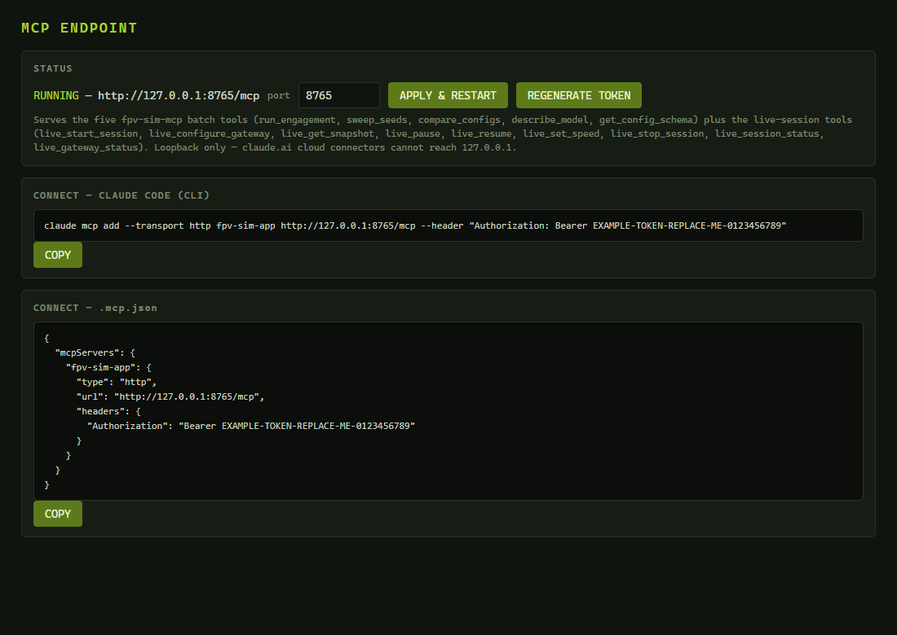

# 8. The MCP Endpoint and Claude Code

FPV Sim runs a small **Model Context Protocol (MCP)** server on your own PC. Any MCP client — Claude Code is the one this chapter uses — can then call the application's tools: run an engagement, sweep seeds, compare configurations, and start, watch, pause and stop live sessions, including staging the DIS gateway. This chapter gets you from the panel to a working first tool call.

> **Before you start**
> - FPV Sim installed (Chapter 2) and running.
> - [Claude Code](https://docs.anthropic.com/en/docs/claude-code) installed and signed in, following Anthropic's instructions. This manual does not repeat them.
> - Nothing in this chapter is required for Chapters 9 or 10. The DIS gateway can be staged from the Live Ops panel without an MCP client; MCP is the automation route.

## 8.1 The MCP Endpoint panel

Click the **MCP ENDPOINT** tile.


*Figure 8-1. The MCP Endpoint panel with the endpoint RUNNING and both copy-paste snippets. (The token shown is a placeholder; yours is a random 32-character secret.)*

| Element | Meaning |
|---|---|
| **STATUS** | **RUNNING — http://127.0.0.1:8765/mcp** when the server is up and healthy; **LISTENING BUT UNHEALTHY** if it is up but not answering; **DOWN — port 8765 is in use** (or another reason) if it could not start. |
| **port** + **APPLY & RESTART** | Change the TCP port (1024–65535) and restart the server. Every client must then be re-added with the new address. |
| **REGENERATE TOKEN** | Replace the bearer token with a new random one. Every existing client stops working until it is re-added with the new snippet. |
| **CONNECT — CLAUDE CODE (CLI)** + **COPY** | A one-line `claude mcp add …` command carrying the address and the token. |
| **CONNECT — .mcp.json** + **COPY** | The same connection as a JSON block for a project's `.mcp.json` file. |

The server listens on `127.0.0.1` only. Nothing outside your PC can reach it, which also means cloud-hosted connectors (claude.ai's own connectors, for example) cannot; use a client that runs on the same machine.

> [!WARNING]
> The copied snippet contains your bearer token. Treat it like a password: paste it into your own tools, never into a shared document.

## 8.2 Connect Claude Code

1. In the panel, confirm **STATUS** reads **RUNNING**.
2. Under **CONNECT — CLAUDE CODE (CLI)**, click **COPY**.
   → *The button reads **COPIED** for a moment.*
3. Open PowerShell (or Windows Terminal) in the folder you will work from and paste the command:
   ```text
   claude mcp add --transport http fpv-sim-app http://127.0.0.1:8765/mcp --header "Authorization: Bearer <your token>"
   ```
   → *Claude Code confirms:* `Added HTTP MCP server fpv-sim-app with URL: http://127.0.0.1:8765/mcp to local config`.
   By default the server is registered for that folder only. Add `--scope user` before the server name to make it available in every folder.
4. Start Claude Code with `claude`, then type `/mcp`.
   → *The list shows `fpv-sim-app` as **connected**, with its 14 tools.*
5. Make a first call. Type:
   > Use the fpv-sim-app tool `describe_model` and summarise it in three sentences.

   → *Claude Code asks permission to use the tool the first time; approve it. The answer describes the DF measurement model, the fix estimator and the honesty gates.*

Alternative for a project: click **COPY** under **CONNECT — .mcp.json** and paste the block into the project's `.mcp.json` file (merge the `mcpServers` object if the file already exists). Claude Code picks it up when started in that project.

## 8.3 What you can ask for

The endpoint serves fourteen tools; [Appendix E](E-mcp-tools-reference.md) documents each one. In practice you phrase requests in plain language and the assistant chooses the tool.

| You say | Tool used | What comes back |
|---|---|---|
| "Run seed 20260719 in orbit mode and tell me who won and when." | `run_engagement` | Outcome and reason, duration, phase timeline, per-team fix quality, LOB counts, the event log. |
| "Sweep seeds 1–200 with the DF bearing error doubled and give me the win rates." | `sweep_seeds` with `config_overrides` | Aggregate outcomes, win rates, time-to-fix statistics, notable seeds. |
| "Compare stock against OPFOR adopting BLUFOR's discipline over the same 500 seeds." | `compare_configs` | Both arms plus the paired deltas and outcome flips. |
| "Which parameters can I override, with their ranges?" | `get_config_schema` | Every overridable key with unit, default, range and description. |
| "Start a live session on seed 66 at 4× and tell me when BLUFOR fixes." | `live_start_session`, then `live_get_snapshot` / `live_session_status` | A running session you can also watch in the Live Ops panel. |
| "Stage the DIS gateway for broadcast on port 3000 with the anchor at 21.35, −157.95." | `live_configure_gateway` | `{ "ok": true }`, and the Live Ops GATEWAY box reads *configured for next session*. |

Batch tools (`run_engagement`, `sweep_seeds`, `compare_configs`) return in seconds and never touch your results folder — they are for questions, not for producing Dashboard datasets. Use the Studies panel (Chapter 6) when you want a dataset.

## 8.4 Security notes

- The token is a secret. Regenerate it (**REGENERATE TOKEN**) if a snippet leaked, then re-add the server in your clients.
- Changing the port also invalidates existing client registrations — re-add with the new snippet.
- The server accepts requests only from the same PC. It is not exposed on your network.
- Live tools can start sessions that transmit on the network when a gateway is staged. That is exactly what Chapter 10 wants, but be aware that an assistant with this endpoint can do it on request.

## 8.5 Troubleshooting

| Symptom | Cause and fix |
|---|---|
| **STATUS** shows **DOWN — port 8765 is in use** | Another program owns the port. Change the port (**APPLY & RESTART**) and re-add the server. |
| Claude Code reports `401 Unauthorized` | The token changed (regenerated) or the snippet was pasted incompletely. Copy and add again. |
| `/mcp` shows the server as failed | FPV Sim is not running, or the port changed. Start FPV Sim, check **STATUS**, re-add if needed. |
| A tool call hangs | A very large `sweep_seeds` can take a while; 200–500 seeds is a sensible interactive size. |
