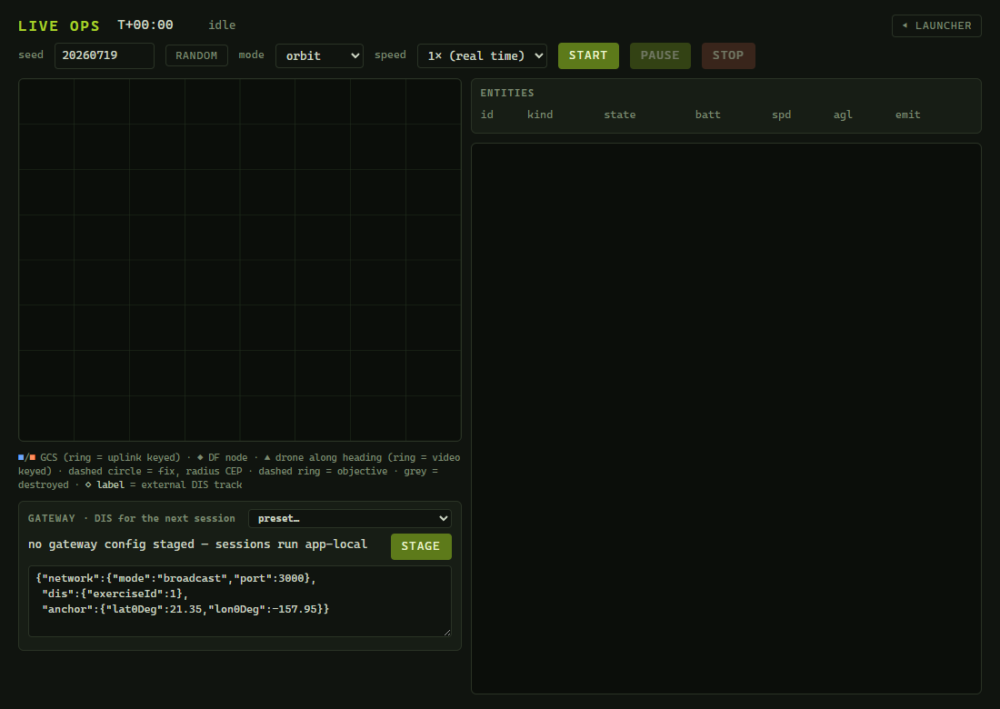
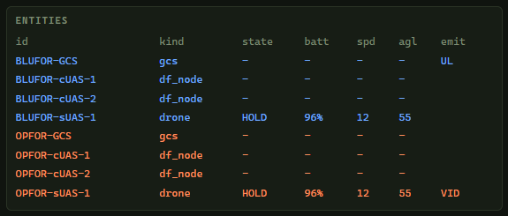
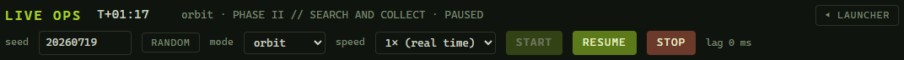
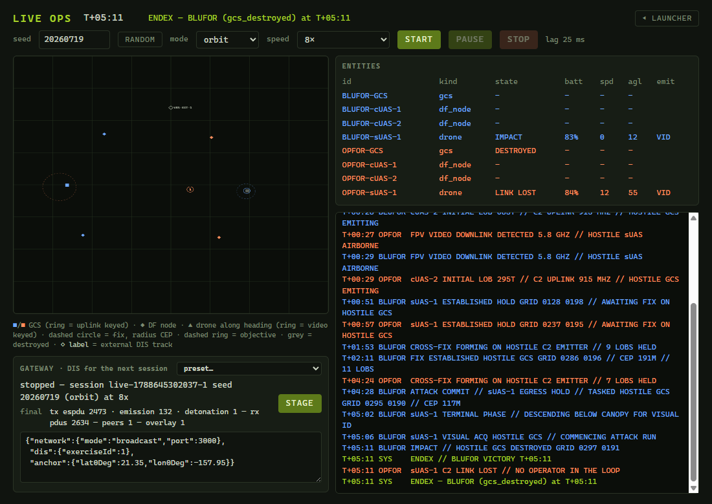

# 9. Live Ops: real-time sessions

The Simulation window plays an engagement as fast as your screen refreshes. **Live Ops** runs one at a chosen pace against the wall clock — real time or a multiple of it — in a separate process, with a live map, an entity table and an event feed. It is the panel from which the DIS gateway is staged and observed (Chapter 10), but it is useful on its own: a paced session is what you would put in front of an audience, or feed to another simulator.

> **Before you start**
> FPV Sim installed (Chapter 2). Nothing else.

## 9.1 What a live session is

- A live session is **the same engagement, paced**. A session run to its end produces exactly the result the batch engine produces for the same seed, mode and overrides; the application's own checks verify this on every build. Pausing, changing speed and streaming over DIS are observation concerns and cannot change the outcome.
- **One session at a time.** Starting another while one is running is refused.
- The session runs in its own process. Closing the Live Ops window does not stop it; reopening the window picks it up again. Closing the last FPV Sim window quits the application and stops it, after asking you to confirm while a session is active.

## 9.2 The panel

Click the **LIVE OPS** tile.

*Figure 9-1. Live Ops before a session: the header controls, the empty map, the GATEWAY box, the ENTITIES table and the event feed.*

### Header

| Control | Meaning |
|---|---|
| Clock `T+00:00` | Simulated time. |
| Phase text | `idle`; while running `orbit · PHASE II // SEARCH AND COLLECT`, with `· PAUSED` appended when paused; at the end an `ENDEX — …` card, or `ABORTED — …` in red if the session process failed. |
| **seed** + **RANDOM** | 0 to 4,294,967,295. Default 20260719. **RANDOM** picks one; the seed is remembered for the next time either way. |
| **mode** | **orbit** or **tactical**. |
| **speed** | **0.5×**, **1× (real time)**, **2×**, **4×**, **8×**, **20×**, **60×**. Can be changed while a session runs. |
| **START** | Starts a session with the seed, mode and speed shown. |
| **PAUSE** / **RESUME** | Holds and releases the pacing; the simulated clock stops. |
| **STOP** | Ends the session. |
| `lag N ms` | How far the session is behind its schedule. Turns red above 500 ms — the PC cannot keep pace at that speed; pick a lower one. |
| Message line | Under the header, empty until something is refused or goes wrong: `refused: session live-… is running; stop it first`, `the session ended abnormally: …`. |

### Map

A 4 km × 4 km plan view with a 500 m grid, the same frame as the Simulation window. The legend under the map is this table in one line.

| Symbol | Meaning |
|---|---|
| Filled square | A ground control station. A ring around it means its C2 uplink is keyed. |
| Filled diamond | A DF node. |
| Arrowhead | A drone, pointing along its heading. A ring means its video downlink is keyed. Drones are drawn only once launched. |
| Dashed circle in a team's colour | That team's fix on the enemy GCS; the radius is the CEP. |
| Dashed ring labelled `OBJ TANTO` | Tactical mode: the objective. |
| Grey symbol | Destroyed or downed. |
| Hollow grey diamond with a label | An **external** entity received over DIS (an overlay track, Chapter 10). Display only. |

Blue is BLUFOR, orange-red is OPFOR.

### GATEWAY

The status line reads `no gateway config staged — sessions run app-local` until you stage a DIS configuration. The text box holds the configuration JSON and **STAGE** validates and stages it for the next session; the **preset…** menu in the box's title fills the text with one of the ready-to-paste configurations from Appendix C (broadcast, unicast, multicast, VBS4 through VBS Gateway), after which you set the anchor and press **STAGE**. While a gateway-armed session runs, the box turns into a status display — a short line with a small table under it: PDUs sent by type, what arrived on the socket, the peers heard, the external entities on the map — and the text box and preset menu come back when the session ends (nothing can be staged until then anyway). Chapter 10 covers this box in full; you can ignore it for app-local sessions.

### ENTITIES

One row per entity, coloured by side.

*Figure 9-2. The ENTITIES table: id, kind, state, battery, speed, altitude, emitters keyed.*

| Column | Meaning |
|---|---|
| `id` | `BLUFOR-GCS`, `BLUFOR-cUAS-1`, `BLUFOR-sUAS-1`, `OPFOR-GCS`, … |
| `kind` | `gcs`, `df_node`, `drone` — tactical drones add a role: `drone:STRIKE`, `drone:HUNTER`. |
| `state` | Drone state (`STANDBY`, `HOLD`, `COMMIT`, `TERMINAL`, `IMPACT`, `LINK LOST`, `DOWNED`); `DESTROYED` for a dead GCS; `-` otherwise. |
| `batt` | Battery, per cent. |
| `spd` | Speed, m/s. |
| `agl` | Height above ground, metres. Ground entities show `-`. |
| `emit` | `UL` — the GCS uplink is keyed; `VID` — the drone's video is keyed; `UL+VID` when both apply. |

### Events

The engine's event stream, one line per event: `T+00:26 BLUFOR cUAS-2 INITIAL LOB 065T // C2 UPLINK 915 MHZ // HOSTILE GCS EMITTING`. The last 500 lines are kept; the feed follows the newest. `SYS` lines are green.

## 9.3 Run a session

1. Leave **seed** at `20260719`, **mode** at **orbit**, **speed** at **1× (real time)**.
2. Click **START**.
   → *Within a second the map shows the two GCS and four DF nodes, the ENTITIES table fills, and the events begin at T+00:00. At real time the drones launch after 20 and 26 seconds.*

*Figure 9-3. A session at T+01:15, real time: both drones in their holds, OPFOR's uplink keyed, the event feed following along.*

3. Change **speed** to **8×** while it runs.
   → *The clock accelerates; `lag` stays near 0 ms on a modern PC.*
4. Click **PAUSE**.
   → *The clock stops, the phase text gains `· PAUSED`, and the button reads **RESUME**.*

*Figure 9-4. PAUSE holds the sim clock; the button becomes RESUME.*

5. Click **RESUME** and let the session run to its end (about five minutes of simulated time for this seed).
   → *The header shows `ENDEX — BLUFOR (gcs_destroyed) at T+05:11`, the same line arrives as a green SYS event, the OPFOR GCS row reads `DESTROYED`, and START is enabled again.*

*Figure 9-5. ENDEX: the outcome and reason in the header and as the last SYS event.*

Pressing **STOP** at any time ends the session early; the header then reports the stop rather than an outcome.

## 9.4 Details worth knowing

| Detail | |
|---|---|
| The ENTITIES table | Drones appear only once launched; a battery-exhausted drone shows `DOWNED`, a drone whose GCS died shows `LINK LOST`. |
| The fix circles | They appear when a side first solves a fix and shrink as it tightens; the Simulation window draws the full ellipse, Live Ops the CEP circle. |
| Refusals | `refused: session live-… is running; stop it first` (in the message line under the header, and in the feed) means a session is already active. `refused: seed must be an integer in 0..4294967295` means the seed field is out of range. |
| Reopening the panel | A panel opened while a session runs, or after one ended, shows the whole event feed of that session, not only what happens from that moment on. |
| Speed and the outcome | Speed, pause and resume change pacing only. The result of a session run to its end is byte-identical to the batch result of the same seed. |
| Sessions started elsewhere | A session started through the MCP tool `live_start_session` (Chapter 8) appears here too; the panel reflects whatever session is running, whoever started it. |
