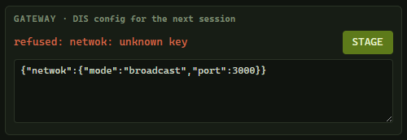
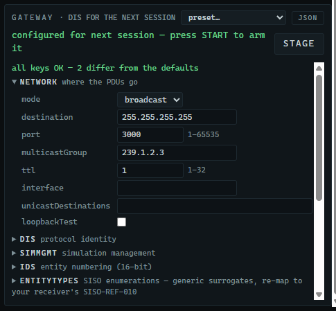
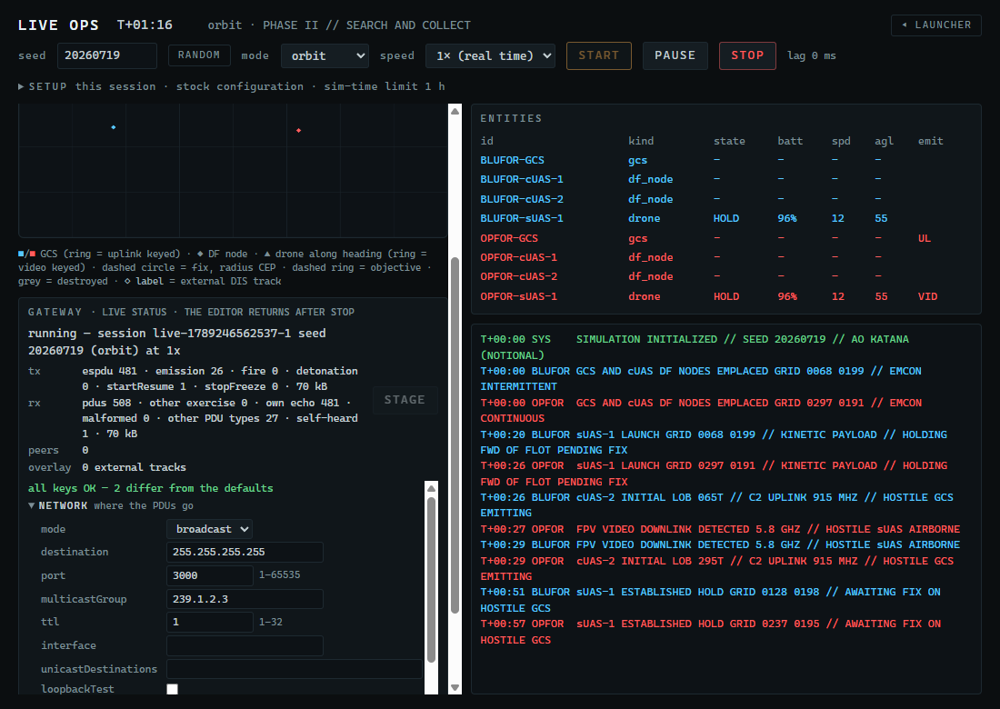
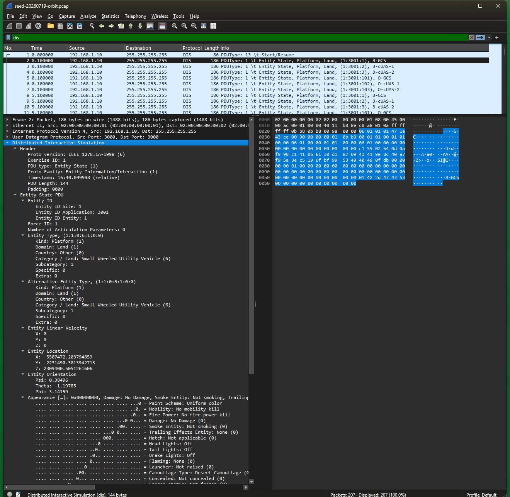

# 10. Sending your entities over DIS

FPV Sim can stream a live session as **IEEE 1278.1 Distributed Interactive Simulation (DIS)** protocol data units over UDP: Entity State for every GCS, DF node and drone, Electromagnetic Emission for every keyed radio, one Detonation for the strike, and Start/Resume and Stop/Freeze for session management. Any DIS-capable tool on the network — Wireshark, VBS4 through its VBS Gateway, an HLA federation through a DIS bridge — sees your engagement as it happens. This chapter takes you from nothing to your own Entity State PDUs arriving at a receiver.

> **Before you start**
> - FPV Sim installed (Chapter 2). Nothing else on the sending PC.
> - A **receiver**. The simplest is [Wireshark](https://www.wireshark.org/) on any PC, including the sending PC itself. The developer checkout's `dis-listen` tool is an alternative (10.6).
> - If the receiver is a different PC: both on the same subnet, and inbound UDP port 3000 allowed through the receiver's firewall (10.8).
> - The latitude and longitude you want the engagement placed at.

## 10.1 How the gateway works

The gateway is part of a live session (Chapter 9). It is armed by **staging** a JSON configuration; the *next* session you start then publishes DIS. Three facts shape everything below:

1. **Staging happens in the Live Ops panel's GATEWAY box** (or through the MCP tool `live_configure_gateway`, 10.9). The configuration is validated when you press **STAGE** and every problem is reported with its exact key path.
2. **The staged configuration lives in memory.** It applies to every session you start for the rest of this run of FPV Sim and is disarmed when the application closes. The text you last staged comes back in the GATEWAY box on the next launch, so re-arming is one press of **STAGE**.
3. **Staging is refused while a session is running or paused.** Press **STOP** first.

What goes on the wire, in order, for the default orbit seed at 1×:

| When | PDUs |
|---|---|
| **START** | One Start/Resume, then six Entity State PDUs at once: both GCS and all four DF nodes. |
| T+00:20 and T+00:26 | Entity State for each drone as it launches. From then on every entity re-sends on a 5 s heartbeat or sooner when its dead-reckoned position drifts more than 2 m or 3°. |
| Every time a radio keys or unkeys | An Electromagnetic Emission PDU (one beam while keyed, none when silent), plus a 10 s heartbeat while keyed. The uplink is modelled at 915 MHz, the video at 5.8 GHz. |
| The strike (T+05:11) | The killer drone's final Entity State, one Detonation (with `EntityImpact`), the target GCS's destroyed Entity State, and the consequent emission unkeys. Fire PDUs are off by default. |
| After ENDEX | Wrecks keep heart-beating with the *Destroyed* appearance (and a 60 s *flaming* period) until you press **STOP**. |
| **PAUSE** / **RESUME** | Stop/Freeze (reason *Recess*) and Start/Resume. |
| **STOP** | Nothing, unless `simMgmt.endVbsMissionOnStop` is set (see the caution in 10.5). |

Traffic is light. The committed 60-second reference capture of this seed holds 207 PDUs — one Start/Resume, 183 Entity State and 23 Electromagnetic Emission — which averages 3.5 PDUs per second at 0.6 kB/s. The instantaneous rate follows how fast things are moving: a little over 1 PDU/s while every entity is still emplaced, rising past 7 PDU/s once both drones are airborne and tripping the dead-reckoning threshold, and highest during the terminal dash. Even at its peak it is negligible on a LAN.

## 10.2 Step A — stage the gateway

1. Open the **LIVE OPS** tile. The GATEWAY box shows the status line `no gateway config staged — sessions run app-local`, a **STAGE** button, an **EXPORT TERRAIN** button (Chapter 11.3) and a text box pre-filled with a minimal configuration (after the first successful **STAGE** it holds whatever you staged last; the **preset…** menu in the box's title fills it with any of the [Appendix C](C-gateway-config-reference.md) configurations):
   ```json
   {"network":{"mode":"broadcast","port":3000},
    "dis":{"exerciseId":1},
    "anchor":{"lat0Deg":21.35,"lon0Deg":-157.95}}
   ```
2. Edit the three things that matter for your setup — see the table — and leave everything else out; every key you do not mention keeps its default ([Appendix C](C-gateway-config-reference.md) lists them all).

   | Key | Set it to |
   |---|---|
   | `anchor.lat0Deg`, `anchor.lon0Deg` | The latitude and longitude, in decimal degrees, where the south-west corner of the 4 km × 4 km AO should sit. **Change these**: the validator accepts the default 0°, 0°, which puts your entities in the Gulf of Guinea — **STAGE** then adds a yellow line, *staged, but check: anchor is 0°, 0°*. |
   | `network.mode`, `network.port` | `broadcast` on port `3000` reaches everything on a flat LAN, including the sending PC. For a specific receiver use unicast: `"network":{"mode":"unicast","unicastDestinations":["192.168.1.20"],"port":3000}`. |
   | `dis.exerciseId` | Must match the receiver's exercise ID. `1` is the usual default. |

3. Click **STAGE**.
   → *The status line turns green:* `configured for next session — press START to arm it`.


*Figure 10-1. A valid configuration staged for the next session.*

If the JSON has a syntax error the line reads `invalid JSON: …`; if a key is unknown or a value out of range it reads `refused:` followed by the exact path, for example `refused: netwok: unknown key` or `refused: anchor.lat0Deg: -89.9..89.9`. Fix the text and press **STAGE** again.


*Figure 10-2. A typo in the gateway JSON is refused with the exact path.*

Prefer fields over JSON? Click **FORM** in the box's title. The same configuration appears as ten collapsible groups — every key with its default, allowed range and one-line meaning, the whole of [Appendix C](C-gateway-config-reference.md) in the app — and every edit rewrites the JSON underneath it, so the two views can never disagree. Keys that differ from the defaults are highlighted and counted per group, values are checked as you type with the exact message **STAGE** would give, and **JSON** brings the text back. The **preset…** menu and **STAGE** work the same in either view.


*Figure 10-3. FORM: the same configuration as fields. The note line counts the keys that differ from the defaults — here the two anchor coordinates — and groups holding a changed key open themselves.*

> [!WARNING]
> The staged configuration is disarmed when FPV Sim closes. After every launch, open Live Ops — the GATEWAY box already holds the text you last staged — and press **STAGE** again before starting a session that others are supposed to see.

## 10.3 Step B — start the session

4. Set **seed** `20260719`, **mode** **orbit**, **speed** **1× (real time)**.
5. Click **START**.
   → *The first time a session opens a network socket, Windows shows a **Windows Security Alert** headed "Windows Defender Firewall has blocked some features of this app", naming **FPV Sim** as the publisher-less app. Tick the network types you actually use — **Private networks** is enough for a lab LAN — and click **Allow access**. Windows asks once and remembers; you will not see it on later sessions unless the rule is removed.*
   → *Within a second the GATEWAY box switches to the live status:* `running — session live-… seed 20260719 (orbit) at 1x`, *with a small table under it —* `tx espdu 6 · emission 0 · fire 0 · detonation 0 · startResume 1 · stopFreeze 0 · 1 kB`, `rx pdus 0 · …`, `peers 0`, `overlay 0 external tracks` *— and the `espdu` and `emission` counters climb as the engagement proceeds.*


*Figure 10-4. A gateway-armed session at real time: the GATEWAY box shows the session, its speed and the PDU counters.*


*Figure 10-5. The GATEWAY box while publishing — the editor gives way to the live status until the session ends. `tx` counts PDUs sent by type; `rx` counts what arrived on the socket and why anything was set aside (another exercise ID, the app's own echo, malformed, other PDU types); `peers` counts remote senders heard; `overlay` counts external entities on the map.*

> [!NOTE]
> Run DIS sessions at **1× (real time)**. The gateway scales velocities so receivers extrapolate correctly at higher speeds, but above 8× (`publish.maxSpeedFactor`) remote smoothing degrades and the status line says so.

## 10.4 Step C — verify at the receiver

Pick one of the two.

### C1 — Wireshark (any PC, no developer checkout)

6. Install Wireshark on the receiving PC (or on this PC — broadcasts are visible on the sending PC's own LAN adapter).
7. Start a capture on the LAN adapter and apply the display filter `dis` (or `udp.port == 3000`, which also catches datagrams Wireshark has not decoded as DIS).
   → *Rows with protocol **DIS** appear — a few per second while the entities are emplaced, several times that once the drones are moving. The Info column names the PDU type: Start/Resume PDU once, then Entity State PDU and Electromagnetic Emission PDU, and one Detonation PDU when the strike lands.*


*Figure 10-6. Your first PDUs in Wireshark: Start/Resume, six Entity States, then emissions.*

8. Click any **Entity State PDU** row and expand *Distributed Interactive Simulation* in the details pane.
   → *Entity ID site 1, application 3001, entity 1; Force ID 1 (friendly); Entity Marking `B-GCS`; Entity Type kind 1 (platform); Entity Location as earth-centred X/Y/Z metres (about −5,507,000 / −2,231,000 / 2,309,000 for the example anchor at 21.35°, −157.95°).*


*Figure 10-7. Reading an Entity State PDU: entity ID, force, marking and location.*

Wireshark decodes DIS automatically on UDP port 3000. If you chose another port, right-click a row, choose **Decode As…** and pick **DIS**. A committed reference capture of the first 60 seconds of this exact seed, `docs/captures/seed-20260719-orbit.pcap` in the source repository, opens in Wireshark with no setup for comparison.

### C2 — dis-listen (developer checkout)

The developer checkout of the repository includes a console decoder. On the receiving PC (or this one):

```bash
npm run dis-listen -- --port=3000 --mode=broadcast --anchor=21.35,-157.95
```

→ *One line per PDU, positions converted back into the AO's local metres because you passed the anchor:*

```text
dis-listen: broadcast port 3000 anchor 21.35,-157.95 — ctrl-c to stop
21:53:10.402 192.168.1.10:53211 ex1 t+0.1r START/RESUME req 1
21:53:10.403 192.168.1.10:53211 ex1 t+0.1r ESPDU 1:3001:1 "B-GCS" force1 local(680,1990,12) spd 0.0 dr1 app 0x0
21:53:10.403 192.168.1.10:53211 ex1 t+0.1r ESPDU 1:3001:2 "B-cUAS-1" force1 local(1160,2740,31) spd 0.0 dr1 app 0x0
…
21:53:30.512 192.168.1.10:53211 ex1 t+20.2r ESPDU 1:3001:11 "B-sUAS-1" force1 local(690,1996,4) spd 8.1 dr2 app 0x0
21:53:36.607 192.168.1.10:53211 ex1 t+26.3r EE 1:3001:1 systems 1 KEYED 915.0 MHz erp 30 dBm
21:53:40.611 192.168.1.10:53211 ex1 t+30.3r EE 1:3001:1 systems 1 SILENT (0 beams)
```

`MALFORMED` lines mean the receiver could not decode a datagram; a clean run has none. Add `--pcap=<file>` to save the traffic for Wireshark.

## 10.5 During the session

| You do | On the wire |
|---|---|
| **PAUSE** | Stop/Freeze with reason *Recess*; entities freeze at the receiver. |
| **RESUME** | Start/Resume. |
| Change **speed** | Every entity re-sends at once with velocities scaled to the new pace. Stay at or below 8×. |
| **STOP** | Nothing is sent; the receiver's entities time out on their own. |
| Let it run to ENDEX | The Detonation, the destroyed GCS, and wreck heartbeats until you press **STOP**. |

> [!CAUTION]
> Setting `"simMgmt":{"endVbsMissionOnStop":true}` makes **STOP** send Stop/Freeze with reason *Termination*, which **ends a running VBS4 mission**. Leave it at its default (`false`) unless that is what you want.

## 10.6 Receiving other people's entities

The gateway also listens. Entity State PDUs from other senders on the same exercise ID appear on the Live Ops map as hollow grey diamonds with their marking, and the GATEWAY box counts them: `peers 1 · overlay 1`.


*Figure 10-8. An external DIS entity (`VBS-EXT-1`) received on the wire renders as a grey diamond overlay; the box reads peers 1 · overlay 1.*

Rules of the overlay:

- Display only. Received entities never influence the engagement, so determinism is preserved by construction.
- Only Entity State PDUs are tracked; received Start/Resume and the like are counted but never obeyed.
- Traffic on another exercise ID is ignored (`receive.exerciseFilter`), and so is the gateway's own site/application pair.
- A silent track expires after 12 s (`receive.timeoutS`); until then it is extrapolated for up to 5 s.
- Entities outside the 4 km box are counted but not drawn.

## 10.7 What identifies your entities

| Entity | DIS entity number | Marking | Force ID |
|---|---|---|---|
| BLUFOR GCS | 1 | `B-GCS` | 1 |
| BLUFOR DF nodes | 2, 3 | `B-cUAS-1`, `B-cUAS-2` | 1 |
| BLUFOR drones | 11, 12, … | `B-sUAS-1`, … | 1 |
| OPFOR GCS | 101 | `O-GCS` | 2 |
| OPFOR DF nodes | 102, 103 | `O-cUAS-1`, `O-cUAS-2` | 2 |
| OPFOR drones | 111, 112, … | `O-sUAS-1`, … | 2 |

All under site **1**, application **3001** (`dis.siteId`, `dis.applicationId`), exercise **1**, DIS protocol version **6**. Entity types are generic surrogates — drone `1.2.0.50.1.1.0`, GCS `1.1.0.6.1.0.0`, DF node `1.1.0.6.2.0.0`, warhead `2.9.0.1.1.0.0` — and can be re-mapped per site through `entityTypes` (Appendix C) or on the receiving side.

## 10.8 One PC or two

| Setup | Configuration | Notes |
|---|---|---|
| **Two PCs, flat LAN** | `broadcast`, port 3000 | The receiver's firewall must allow **inbound UDP 3000** (Windows: *Windows Defender Firewall with Advanced Security ▸ Inbound Rules ▸ New Rule ▸ Port ▸ UDP 3000*). Both PCs on the same subnet. |
| **Two PCs, specific receiver** | `unicast` with the receiver's IP in `unicastDestinations` | The most reliable choice on laptops with VPN, Hyper-V or WSL adapters, which may broadcast on the wrong interface. |
| **One PC** | `broadcast`, port 3000 | The app, Wireshark, `dis-listen` and VBS can share the port on one machine. No firewall rule needed. |
| **Multi-homed PC, multicast** | `multicast` plus `network.interface` set to the LAN adapter's IPv4 | Multicast on Windows needs the interface named explicitly. |


*Figure 10-9. Receiving PC: the inbound rule's **Protocols and Ports** tab — protocol UDP, local port 3000.*

## 10.9 The automation route: MCP

Everything above can be done by an assistant connected through the MCP endpoint (Chapter 8):

- `live_configure_gateway` with `{"config": {…}}` stages the same JSON and returns `{ "ok": true }` or the same `path: message` errors.
- `live_gateway_status` reports `pendingConfig: true` once staged, and the live counters while a session runs.
- `live_start_session` with a `gateway` object stages and starts in one call; with `speed: 1` for interop.

The Live Ops panel reflects whatever the assistant does.

## 10.10 Checklist

- [ ] Anchor latitude and longitude set to your site.
- [ ] Speed **1× (real time)** (never above 8×).
- [ ] Configuration staged **in this run** of FPV Sim.
- [ ] Session stopped before re-staging.
- [ ] Exercise ID matches the receiver.
- [ ] Receiver's firewall allows inbound UDP 3000; sender allowed through Windows Security Alert.
- [ ] On multi-homed PCs: unicast, or `network.interface` set.

Next: Chapter 11 for VBS4 Gateway settings, terrain correlation and HLA, or [Appendix H](H-vbs4-quick-start.md) for a worked example that takes a fresh PC through this chapter, the VBS Gateway settings and the reverse path in one sitting.
