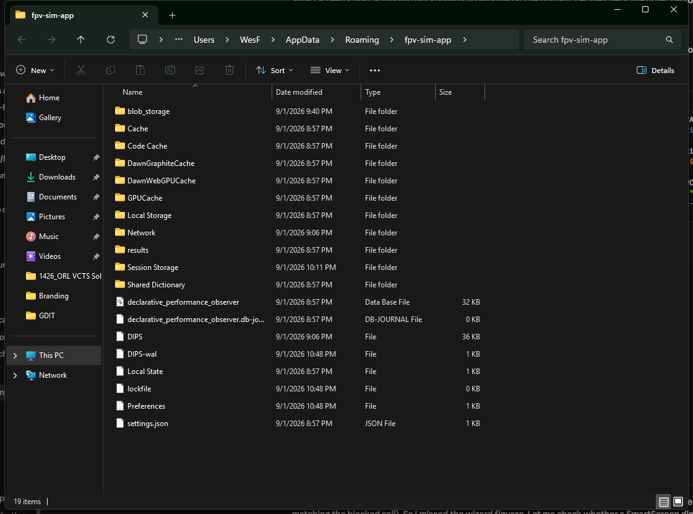

# B. Files and settings

## B.1 Program folder

| Item | Default location |
|---|---|
| The application | `%LOCALAPPDATA%\Programs\FPV Sim\` — `FPV Sim.exe`, the Electron runtime, and a `resources\` folder holding the bundled engine, the three UI pages, the panels and the study runners |
| Uninstaller | `Uninstall FPV Sim.exe` in the same folder |
| Shortcuts | Start menu and desktop, both **FPV Sim** |

Nothing in the program folder is meant to be edited. Upgrades replace it in full.

## B.2 Data folder — `%APPDATA%\fpv-sim-app`

Paste `%APPDATA%\fpv-sim-app` into the File Explorer address bar to open it.


*Figure B-1. Where your data lives: the results store and the settings file.*

| Path | Content |
|---|---|
| `results\index.json` | The **manifest** — the list of datasets the Dashboard shows, newest first. |
| `results\monte-carlo.json` | The bundled orbit study (22,800 engagements). Replaced by **RUN FULL** in orbit mode. |
| `results\monte-carlo-tactical.json` | The bundled tactical study (24,800 engagements). Replaced by **RUN FULL** in tactical mode. |
| `results\adhoc-df-bearing-error-doubled-8-deg-2026-08-24.json` | The bundled example sweep. |
| `results\adhoc-<slug>-<YYYY-MM-DD>.json` | Your ad-hoc sweeps. |
| `results\monte-carlo-quick.json`, `results\monte-carlo-tactical-quick.json` | Written by **RUN QUICK**; **not** listed in the manifest. |
| `terrain\seed-<n>-elevation-egm96.tif`, `…-ellipsoid.tif`, their `.json` metadata, `terrain\seed-<n>-canopy.tif` | The folder **EXPORT TERRAIN** offers first and `live_export_terrain` writes into unless told otherwise (Chapter 11.3). Created on first export; safe to delete. |
| `settings.json` | `{ "version": 2, "mcp": { "port": 8765, "token": "…" }, "ui": { … } }` — the MCP endpoint's port and bearer token, plus what the panels remember (B.3). Created on first launch. |
| Other folders (`Cache`, `GPUCache`, …) | The embedded browser's own working files. Safe to ignore. |

### The manifest

`index.json` is plain JSON. Each dataset has one entry (abridged):

```json
{
  "datasets": [
    {
      "file": "adhoc-df-bearing-error-doubled-2026-09-02.json",
      "kind": "adhoc",
      "mode": "orbit",
      "label": "DF bearing error doubled",
      "generated": "2026-09-02T01:49:12.000Z",
      "total_runs": 1000,
      "seed_range": { "start": 1, "count": 1000 },
      "overrides": { "CUAS": { "BRG_SIGMA_DEG": 8 } }
    }
  ]
}
```

The Dashboard shows exactly what this list contains: a dataset file that is not listed here is invisible, and an entry whose file is missing fails to load.

### Common operations

Since this release the **DATASETS** box on the Studies panel does all of these from inside the app (Chapter 6.7); the by-hand routes below still work.

| Task | In the app | By hand |
|---|---|---|
| Retire a dataset | **STUDIES ▸ DATASETS ▸ DELETE** — removes the file and its entry together and reloads any open Dashboard. | Close the Dashboard. Delete the dataset file and its `{ … }` entry in `index.json` (keep the JSON valid — mind the commas). Reopen the Dashboard. |
| Restore a deleted bundled dataset | **STUDIES ▸ DATASETS ▸ RESTORE** — copies the factory file and its entry back. | — |
| Restore the whole factory store | — | Close FPV Sim. Delete the whole `results` folder. Start FPV Sim: the folder is recreated with the three bundled datasets. Your own sweeps are gone unless you exported them first. |
| Move results to another PC | **STUDIES ▸ DATASETS ▸ EXPORT** here; copy the file into the other PC's `results` folder; there, **DATASETS ▸ REGISTER** rebuilds the entry from the file. | Copy the dataset file and paste its manifest entry into the other PC's `index.json`. |
| Back up everything | — | Copy `%APPDATA%\fpv-sim-app`. |

## B.3 Settings

`settings.json` holds two things. The MCP endpoint's port and token are managed from the MCP Endpoint panel (Chapter 8). Under `ui` the panels remember what you last used — the launcher's seed, mode and autoplay; the Studies label, seed range, mode and overrides; the Live Ops seed, mode, speed, overrides and sim-time limit — the last gateway configuration that passed **STAGE**, and the size and position of each kind of window. Editing `settings.json` by hand while FPV Sim is running has no effect until the next launch; a token shorter than 16 characters or a port outside 1024–65535 is replaced with a fresh default, and a `ui` entry that is not valid JSON is dropped. A file written by 0.2.x (no `version` key) is upgraded in place on the first launch.

The **DIS gateway is still armed in memory only**: the GATEWAY box reopens with the text you last staged, but nothing transmits until you press **STAGE** again (Chapter 10).

## B.4 What survives an uninstall

Uninstalling removes the program folder and the shortcuts and leaves `%APPDATA%\fpv-sim-app` untouched, so a reinstall finds your datasets and your MCP token again. Delete the folder yourself for a clean removal.

## B.5 Logs and diagnostics

FPV Sim writes no log files. Diagnostics live in three places:

- the **Studies panel log** (the last 800 lines of the current or last run, while the window is open);
- the **Live Ops event feed** (the last 500 events of the current or last session);
- the **Developer Tools console** of any window: press <kbd>Ctrl</kbd>+<kbd>Shift</kbd>+<kbd>I</kbd>, or <kbd>Alt</kbd> and then **View ▸ Toggle Developer Tools** (Chapter 3.6).

When reporting a problem include the launcher footer line (`app 0.4.0 · engine fpv-sim-mcp 0.3.0 · …`); the footer's **COPY** button and **Help ▸ About FPV Sim** both put it on the clipboard. **File ▸ Open Settings Folder** and **File ▸ Open Results Folder** open the two folders above in Explorer.
