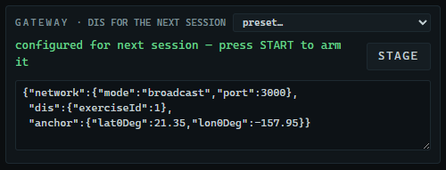
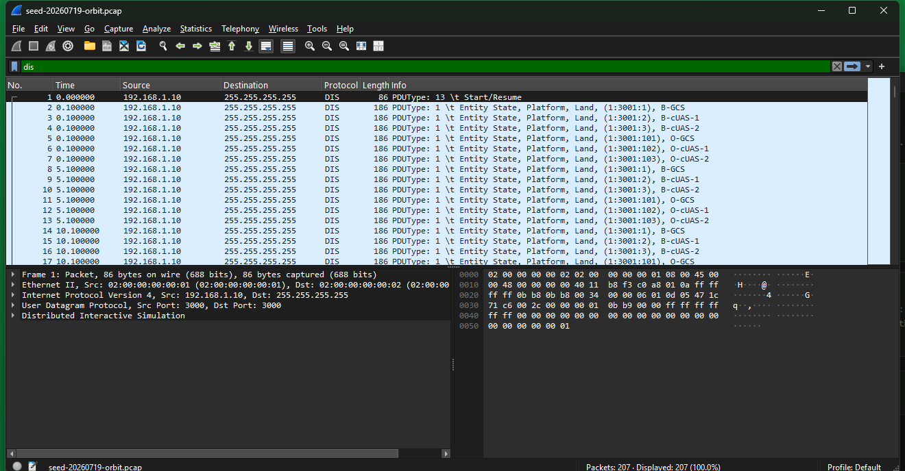
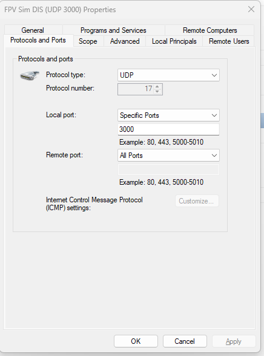
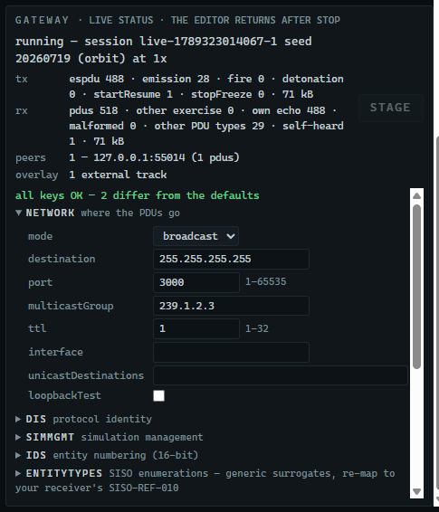
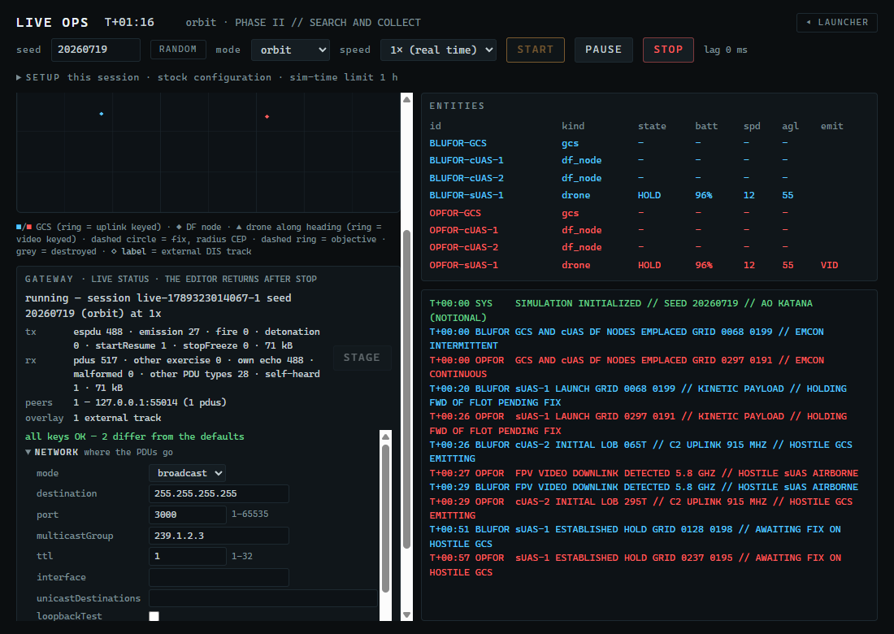

# H. Use case: quick start with an external live virtual simulation (VBS4)

This appendix is one worked example, followed from start to finish: a freshly set-up Windows PC gets FPV Sim installed, and within about an hour its engagement is playing inside **VBS4** on a second PC, with a VBS4 vehicle showing back on the Live Ops map. Chapters 2, 9 and 10 explain each piece on its own; this appendix strings them together in the order you would do them in a lab, with the exact values both sides must agree on. VBS4 is the example because its **VBS Gateway** ships as standard and speaks the same DIS the FPV Sim gateway does; H.9 says what changes for another simulator.

> **Before you start**
> - **Two PCs on one subnet.** This appendix calls them the *FPV Sim PC* (any 64-bit Windows 10/11 PC, a standard user account, nothing installed yet) and the *VBS4 PC* (VBS4 26.1 with its VBS Gateway, and an account that can start VBS4 as an administrator client). The example addresses are `192.168.1.10` and `192.168.1.20`; substitute your own from `ipconfig`.
> - **The installer**, `fpv-sim-app-setup-0.4.0.exe`, downloaded from the Releases page (Chapter 2.2) or carried on a USB stick. The FPV Sim PC needs no internet connection at any point.
> - **A place on the Earth** for the 4 km × 4 km AO: the latitude and longitude of its south-west corner in decimal degrees. Flat coastal ground correlates best with the notional terrain; the example uses `21.35, -157.95`.
> - **An exercise ID** agreed with whoever runs the VBS4 side. The example uses `1`.
> - **Optional:** Wireshark on the FPV Sim PC, for the dry run in H.3. Nothing from the developer checkout is needed anywhere in this appendix.

The VBS Gateway settings quoted below come from the *VBS Gateway* component manual for VBS4 26.1.1 (sections 3.1, 4.5, 5.1, 5.2, 6.3 and 10.6). If your release differs, check the same sections in your copy.

## H.1 The shape of it

```
FPV Sim PC  192.168.1.10                           VBS4 PC  192.168.1.20
┌──────────────────────────┐   DIS over UDP 3000   ┌──────────────────────────────┐
│ FPV Sim                  │ ────────────────────► │ VBS Gateway ──► VBS4         │
│ Live Ops + DIS gateway   │ ◄──────────────────── │ DIS adapter ON, HLA OFF      │
└──────────────────────────┘   Entity State back   └──────────────────────────────┘
```

Both sides must agree on eight values. Everything else can stay at its default.

| Value | FPV Sim: gateway JSON key | VBS Gateway: **Settings ▸ DIS** |
|---|---|---|
| DIS version | `dis.protocolVersion` = `6` (default) | General ▸ **Version** = 6 |
| Exercise ID | `dis.exerciseId` = `1` (default) | ID Filtering ▸ **Exercise ID** = 1 |
| Site ID | `dis.siteId` = `1` (default) | General ▸ **Site ID** = 1. The Gateway ignores traffic from other site IDs. |
| Application ID | `dis.applicationId` = `3001` (default) | General ▸ **Application ID** = anything but 3001 (**auto** is fine). The Gateway ignores traffic carrying its own application ID. |
| UDP port | `network.port` = `3000` (default) | Connection ▸ **Send Port** = 3000 and **Receive Port** = 3000 |
| Where to send | `network.mode` = `unicast`, `unicastDestinations` = the VBS4 PC | Connection ▸ **Send Address** = the FPV Sim PC |
| Emitter function | `emissions.uplink.function` and `emissions.video.function` = `5` (the default; the preset spells it out anyway) | Fixed: the Gateway lists an incoming emitter system only when its function is *Acquisition / Detection* (5). Nothing to set on either side unless a staged configuration overrides it. |
| The anchor | `anchor.lat0Deg`, `anchor.lon0Deg` = your AO | A terrain that covers the same place (H.4) |

The gateway configuration for this example, ready to paste in H.5:

```json
{"network":{"mode":"unicast","unicastDestinations":["192.168.1.20"],"port":3000},
 "dis":{"protocolVersion":6,"exerciseId":1},
 "emissions":{"uplink":{"function":5},"video":{"function":5}},
 "anchor":{"lat0Deg":21.35,"lon0Deg":-157.95}}
```

> [!TIP]
> Unicast is the choice that works on every PC, including laptops with VPN, Hyper-V or WSL adapters. On a flat lab LAN where the FPV Sim PC has a single adapter, `"network":{"mode":"broadcast","port":3000}` works just as well, and VBS Gateway's **Send Address** can then be the broadcast address too.

## H.2 Step 1 — install FPV Sim on the new PC (10 minutes)

Chapter 2 covers every dialog; this is the short form.

1. Put `fpv-sim-app-setup-0.4.0.exe` on the FPV Sim PC and double-click it.
   → *SmartScreen shows **Windows protected your PC**. This is expected for an unsigned installer.*
2. Click **More info**, then **Run anyway**.
3. In the wizard: **Only for me** ▸ **Next >** ▸ accept the location ▸ **Install** ▸ leave **Run FPV Sim** ticked ▸ **Finish**.
   → *The launcher window opens. Its footer reads `app 0.4.0 · engine fpv-sim-mcp 0.3.0 · …`.*
4. Click **LAUNCH** in the launch bar, watch the Simulation window play for a few seconds, and close it.

The PC is now complete. No Node.js, no Python, no further downloads, no administrator rights.

## H.3 Step 2 — prove the wire on the FPV Sim PC alone (10 minutes)

Do this before anyone on the VBS4 side is waiting on you. It confirms three things: the gateway opens its socket, Windows lets the application through, and what leaves the PC decodes as DIS.

1. Open the **LIVE OPS** tile.
   → *The GATEWAY box reads `no gateway config staged — sessions run app-local` above a text box pre-filled with a minimal configuration.*
2. In the text box (or after picking **Broadcast on a flat LAN** from the **preset…** menu), change the two anchor numbers to your AO and leave the rest as it is. Broadcast on port 3000 needs no receiver to exist:
   ```json
   {"network":{"mode":"broadcast","port":3000},
    "dis":{"exerciseId":1},
    "anchor":{"lat0Deg":21.35,"lon0Deg":-157.95}}
   ```
3. Click **STAGE**.
   → *The status line turns green: `configured for next session — press START to arm it`. If it reads `refused: …`, the path it names is the key to fix.*


*Figure H-1. STAGE accepted the configuration. This is the state the box must be in before every DIS session.*

4. Leave **seed** `20260719`, **mode** **orbit**, **speed** **1× (real time)**. Click **START**.
   → *A **Windows Security Alert** appears the first time. Tick **Private networks** and click **Allow access**. Windows remembers.*
   → *Within a second the GATEWAY box switches to `running — … tx espdu 6, emission 0, fire 0, detonation 0, startResume 1, …`: one Start/Resume and six Entity State PDUs are already out.*
5. If Wireshark is installed, start a capture on the LAN adapter with the display filter `dis`.
   → *Rows with protocol **DIS** appear: Start/Resume once, then Entity State PDUs, then Electromagnetic Emission PDUs as the radios key. Two more Entity States arrive at T+00:20 and T+00:26 when the drones launch.*


*Figure H-2. The first PDUs of a session in Wireshark on the sending PC.*

6. After a minute, click **STOP**.

Without Wireshark, the climbing `espdu` and `emission` counters in the GATEWAY box are the check; they prove the socket and the firewall, not the decoding. The developer checkout's `dis-listen` (Chapter 10.4, C2) is the third option.

> [!WARNING]
> The staged configuration is armed in memory only and is disarmed when FPV Sim closes. Every time you launch the application, open Live Ops — the GATEWAY box already holds the text you last staged — and press **STAGE** again before a session that VBS4 is supposed to see.

## H.4 Step 3 — prepare the VBS4 PC (15 minutes)

1. **Firewall.** Allow inbound UDP 3000 on the VBS4 PC: *Windows Defender Firewall with Advanced Security ▸ Inbound Rules ▸ New Rule ▸ Port ▸ UDP ▸ 3000*.


*Figure H-3. The receiving PC's inbound rule: protocol UDP, local port 3000.*

2. **Start VBS4 with the Gateway enabled.** VBS Gateway is off by default and only available when VBS4 is started with the `-gateway` option. In the VBS4 Launcher: on the **Client** tab choose the **VBS4 Offline** (or Online) configuration and tick **admin**; on the **Server** tab tick **gateway**; click **Launch Modules**. Start exactly one VBS4 instance this way; a second one duplicates every entity.
3. **Open the Gateway UI**: in VBS Editor, **Tools ▸ Show Gateway UI**, or in a browser on the VBS4 PC, `http://localhost:4100/Gateway/index.html#/`.
4. **Settings ▸ DIS.** Set the values from the table in H.1: **Version** 6; **Site ID** 1; **Application ID** auto; **Use Absolute Timestamps** unticked; **Exercise ID** 1; **Filtering Type** None; **Send Address** `192.168.1.10` (the FPV Sim PC); **Send Port** 3000; **Receive Address** all local interfaces, or the LAN adapter; **Receive Port** 3000. Click **Apply**, then switch **DIS** to **ON**.
5. **Settings ▸ HLA.** Leave every HLA adapter **OFF**.

> [!IMPORTANT]
> Never run the DIS adapter and an HLA adapter at the same time. VBS documents the combination as causing inconsistent behaviour.

6. **Settings ▸ General ▸ Filtering.** If a filter type is active, make sure its region encloses the whole 4 km box around your anchor (a **Geo** filter centred on the AO needs a radius of about 3,000 m). Otherwise leave filtering off.
7. **Settings ▸ General ▸ Fuzzy Mapping and VBS.** For a first session, tick **Air**, **Ground** and **Munition** under Fuzzy Mapping and tick **Show Unknown Entities** under VBS. Anything the Gateway cannot map then still appears, as the closest model or as the unknown-entity marker, so you see the engagement on the first try and refine the models afterwards.
8. **Terrain.** Open a Battlespace or scenario whose terrain covers the anchor coordinates, and enter Execute mode so a mission is running. For terrain that matches the engagement's ridges and coastline, import the exported DEM (Chapter 11.3) at the same coordinates; that is the better demo but not required.
9. **Mappings** (optional now, needed eventually). On the Gateway's **Mappings** page: **Add Mapping** ▸ **Change VBS Model** ▸ pick a model ▸ under Incoming, **Add Remote Mapping** ▸ type the enumeration ▸ **Add**. Do it for the four surrogates:

| FPV Sim entity | Enumeration (kind.domain.country.category.subcategory.specific.extra) | Suggested model |
|---|---|---|
| Drone | `1.2.0.50.1.1.0` | any small quadcopter |
| GCS | `1.1.0.6.1.0.0` | a soft-skin vehicle |
| DF node | `1.1.0.6.2.0.0` | a soft-skin vehicle or trailer |
| Warhead (Detonation) | `2.9.0.1.1.0.0` | a small warhead |

Once entities have been seen, the **Active Entities** page's **Unmapped** filter shows exactly which ones still need a model, with an **Edit** icon that opens the same dialog. Record the mapping you settle on; the enumerations can be changed on the FPV Sim side instead, through `entityTypes` (Appendix C).

## H.5 Step 4 — the joint session (10 minutes)

On the FPV Sim PC:

1. Open **LIVE OPS**. If a session is running, click **STOP**.
2. Pick **VBS4 through VBS Gateway** from the GATEWAY box's **preset…** menu — it is the configuration from H.1 — then put the VBS4 PC's address in `unicastDestinations` and your anchor in `anchor`, and click **STAGE**.
   → *`configured for next session — press START to arm it`.*
3. **seed** `20260719`, **mode** **orbit**, **speed** **1× (real time)**, **START**.
   → *The GATEWAY box shows the running session and `tx espdu 6 … startResume 1`.*


*Figure H-4. The GATEWAY box during a session, here with one peer already heard. Until VBS4 has an entity of its own to send, `peers` stays at 0.*

On the VBS4 PC, work down this list. Every line is a pass or fail for the integration:

- [ ] The Gateway's **Active Entities** page lists six incoming entities within a few seconds, eight after the two launches at about T+00:20 and T+00:26.
- [ ] In VBS4's Scenario Objects panel, the ORBAT tab shows them with an **(EXT)** prefix, at the expected grid references: each team's GCS and two DF nodes in its start area, the drones climbing out of them.
- [ ] Markings read `B-GCS`, `B-cUAS-1`, `B-sUAS-1`, `O-GCS`, … and the sides are BLUFOR and OPFOR.
- [ ] The drones fly smoothly. If they rubber-band, stop, stage again with `"deadReckoning":{"drone":{"posThresholdM":1,"oriThresholdDeg":2}}` or `"deadReckoning":{"drone":{"algorithm":4}}`, and restart; the Gateway's own **Dead Reckoning - Incoming** smoothing window is the other knob.
- [ ] While a radio is keyed, its emitter system is listed for that entity in the Gateway UI. In-world RF rendering is not expected; the Gateway UI is the acceptance criterion.
- [ ] At about T+05:11 the strike lands: a detonation effect at the OPFOR GCS, which stays as a destroyed wreck. A drone that runs out of battery shows destroyed without an explosion.
- [ ] **PAUSE** in Live Ops freezes the VBS4 entities (Stop/Freeze, reason *Recess*); **RESUME** moves them again.
- [ ] A second session at **4×** still moves smoothly. Keep demonstrations at 1× and never go above 8×.

## H.6 Step 5 — the reverse path (5 minutes)

1. In VBS4, place any vehicle inside the AO box and give it a short move order.
   → *On the FPV Sim PC, within about five seconds, a hollow grey diamond with the vehicle's name appears on the Live Ops map, and the GATEWAY box reads `peers 1 · overlay 1`.*


*Figure H-5. A VBS4 entity received on the wire, drawn as a display-only overlay track.*

2. Delete the vehicle in VBS4.
   → *The diamond disappears about 12 seconds later.*

If the diamond never appears, the Gateway's **Mappings** page under **Outgoing Unmapped** tells you whether VBS4's model has an outgoing enumeration; ticking **Broadcast Unknown Entity Types** under **Settings ▸ General ▸ VBS** sends unmapped local entities with a fallback type. The "An external entity never shows as an overlay" row in Appendix F covers the FPV Sim side.

Overlay tracks are display only. Nothing VBS4 sends can influence the engagement, so the same seed replays identically afterwards.

## H.7 Wrapping up

- Click **STOP** in Live Ops. Nothing is sent, and VBS4's copies of the entities time out on their own.
- FPV Sim brings the staged JSON back in the GATEWAY box on its next launch; on the VBS4 PC use the Gateway's **Export Mappings** so the mapping survives too. Note the anchor, the two IP addresses and any dead-reckoning threshold you changed. Together those reproduce the session on any other pair of PCs.
- If you captured the session in Wireshark, keep the file. The source repository's `docs/captures/seed-20260719-orbit.pcap` is the reference for the same seed's first 60 seconds.

> [!CAUTION]
> `"simMgmt":{"endVbsMissionOnStop":true}` makes **STOP** send Stop/Freeze with reason *Termination*, and VBS Gateway ends the running VBS4 mission when it receives one. Leave the key at its default unless that is what everyone in the room expects.

## H.8 If something does not work

| Symptom | Check, in this order |
|---|---|
| The Gateway's Active Entities page stays empty | Wireshark on the **VBS4** PC with filter `dis`. No rows means the network: the firewall rule, the subnet, the unicast address, the sender allowed through Windows Security Alert. Rows means the Gateway: DIS **ON**, **Receive Port** 3000, **Exercise ID** and **Site ID** equal to the app's, **Application ID** not 3001. |
| Entities appear as red arrows or a placeholder model | Mapping (H.4 step 9). **Show Unknown Entities** is what made them visible at all. |
| Entities appear off the coast of Africa | The anchor was left at 0°, 0° (**STAGE** shows a yellow warning when that is the case). Stage it again with your latitude and longitude. |
| Entities are mapped but never appear | **Settings ▸ General ▸ Filtering**: the region does not enclose the AO. |
| Entities flicker or vanish between updates | **Settings ▸ DIS ▸ Units ▸ Delete Timeout** is shorter than the app's 5 s heartbeat. |
| No emitter systems are ever listed | The Gateway drops every emitter system whose function is not 5 (*Acquisition / Detection*). That is the shipped default and what the preset stages, so look for an `emissions` block in the staged JSON that sets another function; then check that the `emission` counter in the GATEWAY box is climbing at all. |
| Drones rubber-band | Tighten `deadReckoning.drone.posThresholdM` / `oriThresholdDeg`, try `algorithm` 4, and keep the session at 1×. |
| Every entity appears twice | Two VBS4 instances were started with the Gateway, or **Enable Connectivity on VBS Multiplayer Client** is ticked on a client as well as the host. |
| The VBS4 mission ended when you pressed STOP | `simMgmt.endVbsMissionOnStop` was `true`. |
| The GATEWAY box says `gateway inactive for this session` | The session started before STAGE. **STOP**, **STAGE**, **START**. |

Appendix F has the full FPV Sim-side table.

## H.9 Adapting the example to another simulator

Any tool that speaks DIS over UDP takes the place of VBS Gateway, and the checklist is the same eight values: match the DIS version, exercise ID, port and delivery mode; make sure your site and application IDs are neither ignored nor mistaken for the receiver's own; map the four enumerations, or accept the receiver's fuzzy or unknown-entity fallback; put a terrain at the anchor; and check whether the receiver filters emitter systems by function the way VBS Gateway does (the shipped default, 5, is the one VBS Gateway keeps; `emissions.uplink.function` and `emissions.video.function` change it). Expect the PDU sequence in Chapter 10.1 and run at 1×. For an HLA federation, the same DIS stream goes through a bridge such as the Pitch DIS Adapter; Chapter 11.2 has the RPR-FOM correspondence table for planning the FOM side.
